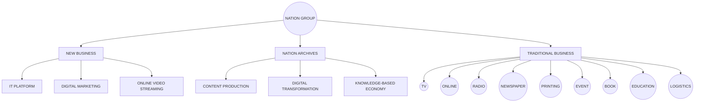
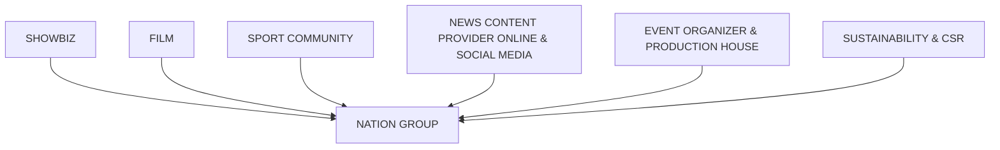

# รายงานการประชุมสามัญผู้ถือหุ้น ประจำปี 2567
ผ่านสื่ออิเล็กทรอนิกส์ (e-meeting)
ของ บริษัท เนชั่น กรุ๊ป (ไทยแลนด์) จำกัด (มหาชน)

## วัน เวลา และสถานที่ประชุม

การประชุมสามัญผู้ถือหุ้น ประจำปี 2567 ของบริษัท เนชั่น กรุ๊ป (ไทยแลนด์) จำกัด (มหาชน) ("บริษัทฯ")
ประชุมเมื่อวันศุกร์ที่ 19 เมษายน 2567 เวลา 14.00 น. ผ่านสื่ออิเล็กทรอนิกส์ (e-meeting) ณ ห้องประชุมสำนักงาน
ของบริษัท ชั้น 10 ถนนเทพรัตน แขวงบางนาใต้ เขตบางนา กรุงเทพมหานคร 10260

## กรรมการบริษัทที่เข้าประชุม และอยู่ในห้องประชุม มีจำนวน 2 ท่าน

1. นายมารุต ธรรคไกรวงศ์         ประธานกรรมการบริษัท
2. นายชนะชัย ลีนะบรรจง         กรรมการอิสระ กรรมการตรวจสอบ
และประธานกรรมการสรรหาและพิจารณาค่าตอบแทน

## กรรมการบริษัทที่เข้าประชุม ผ่านสื่ออิเล็กทรอนิกส์ มีจำนวน 4 ท่าน

1. นายศิริวุฒิ ทองคำ             กรรมการอิสระ และประธานกรรมการตรวจสอบ
2. นายชัยสิทธิ์ ภูวภิรมย์ขวัญ     กรรมการอิสระ กรรมการตรวจสอบ
ประธานกรรมการกำกับกิจการและความยั่งยืน
3. นายเจษฎา บูรณพันธุ์ศรี       กรรมการบริษัท และกรรมการกำกับกิจการและความยั่งยืน
4. นายกำพล แจ้งศิริ แลม         กรรมการบริษัท และกรรมการสรรหาและพิจารณาค่าตอบแทน

## กรรมการบริษัทที่ไม่ได้เข้าประชุม (ลาประชุม)

1. นายอภิวุฒิ ทองคำ             รองประธานกรรมการบริษัท ประธานกรรมการบริหาร
และประธานเจ้าหน้าที่บริหาร
2. นายสมชาย มีเสน              กรรมการบริษัท กรรมการสรรหาและพิจารณาค่าตอบแทน
กรรมการกำกับกิจการและความยั่งยืน
และรองประธานกรรมการบริหาร

รวมมีกรรมการบริษัท เข้าร่วมประชุม จำนวน 6 คน จากจำนวนกรรมการบริษัท ทั้งคณะ 8 คน
(อยู่ระหว่างสรรหาตำแหน่งว่างอีก 1 คน) คิดเป็นร้อยละ 75 ของจำนวนกรรมการบริษัททั้งคณะ

## ผู้บริหารระดับสูงที่เข้าประชุม และอยู่ในห้องประชุม

1. นางวรางคณา กัลยาณประดิษฐ   รองประธานกรรมการบริหาร
2. นางสาวเนตรนภา ภูษิตานนท์    ผู้อำนวยการอาวุโสสายงานบัญชี

## เลขานุการบริษัทที่ร่วมประชุม

นางสาวเสาวภา โชติจิรวัฒน์
---
บริษัท เนชั่น กรุ๊ป (ไทยแลนด์) จำกัด (มหาชน)
รายงานการประชุมสามัญผู้ถือหุ้นประจำปี 2567 ผ่านสื่ออิเล็กทรอนิกส์ (e-meeting)

ผู้สอบบัญชีที่ลงนามรับรองในงบการเงินของบริษัท จาก บริษัท สำนักงาน อีวาย จำกัด
นายพรอนันต์ กิจนะวันชัย

ที่ปรึกษากฎหมายจาก บริษัท ดีเอสที แอนด์ กิบบินส์ จำกัด
นายกรีนทร์วัฒน์ โอสถวณิช

ก่อนเริ่มการประชุม นายอาวุธวิน สุกสี และนางสาววรินยุดา การุณยวนิช ("ผู้ดำเนินการประชุม") ซึ่งได้รับมอบหมายจากประธานกรรมการบริษัท ให้ทำหน้าที่เป็นผู้ดำเนินการประชุมสามัญผู้ถือหุ้น ประจำปี 2567 ("การประชุม" หรือ "ที่ประชุม") ชี้แจงว่า ที่ประชุมคณะกรรมการบริษัท มีมติอนุมัติ ให้กำหนดการประชุมสามัญผู้ถือหุ้นประจำปี 2567 ในรูปแบบผ่านสื่ออิเล็กทรอนิกส์ เพียงช่องทางเดียว ภายใต้พระราชกำหนดว่าด้วยการประชุมผ่านสื่ออิเล็กทรอนิกส์ พ.ศ. 2563 โดยใช้ระบบการประชุมผ่านสื่ออิเล็กทรอนิกส์ของบริษัท อินเวนท์เทค ซิสเท็มส์ (ประเทศไทย) จำกัด ซึ่งได้รับการรับรองจาก สำนักงานพัฒนาธุรกรรมทางอิเล็กทรอนิกส์ หรือ ETDA

นอกจากนี้ ได้แจ้งแนวทางปฏิบัติในการเข้าร่วมประชุมผ่านสื่ออิเล็กทรอนิกส์ รายละเอียดตามสิ่งที่ส่งมาด้วย 8 ในหนังสือเชิญประชุมฯ ซึ่งเป็นไปตามแนวปฏิบัติตามนโยบายการกำกับดูแลกิจการที่ดีของบริษัทฯ เกี่ยวกับการดูแลสิทธิของผู้ถือหุ้นอย่างเป็นธรรมและเท่าเทียมกัน ดังนี้

1. เปิดโอกาสให้ผู้ถือหุ้นเสนอชื่อบุคคลเพื่อเข้าดำรงตำแหน่งกรรมการและเสนอวาระการประชุมสามัญผู้ถือหุ้นประจำปี 2567 โดยผ่านการพิจารณาของคณะกรรมการบริษัท ล่วงหน้าก่อนวันประชุมสามัญผู้ถือหุ้นประจำปี 2567 ซึ่งผู้ถือหุ้นสามารถดาวน์โหลดแบบฟอร์มได้ที่ www.nationgroup.com และนำส่งรายชื่อได้ทางไปรษณีย์โดยส่งถึงประธานคณะกรรมการบริษัท ระหว่างวันที่ 1 พฤศจิกายน 2566 ถึงวันที่ 31 ธันวาคม 2566 ปรากฏว่าไม่มีผู้ถือหุ้นท่านใดเสนอชื่อบุคคลเพื่อเข้าดำรงตำแหน่งกรรมการบริษัท หรือเพิ่มวาระการประชุม

2. เปิดโอกาสให้ผู้ถือหุ้นจัดส่งคำถามล่วงหน้าสำหรับการประชุมสามัญผู้ถือหุ้นประจำปี 2567 ผ่านทางเว็บไซต์ www.nationgroup.com ในระหว่างวันที่ 22 มีนาคม 2567 ถึงวันที่ 17 เมษายน 2567 เพื่อให้คณะกรรมการและฝ่ายบริหารได้รวบรวมเพื่อเตรียมชี้แจงในวันประชุมผู้ถือหุ้น ปรากฏว่า ไม่มีผู้ถือหุ้นเสนอคำถามล่วงหน้าเข้ามา

3. บริษัทเปิดโอกาสให้ผู้ถือหุ้น มอบฉันทะให้กรรมการอิสระเข้าร่วมการประชุม และออกเสียงลงคะแนนแทนผู้ถือหุ้นได้ โดยกรรมการอิสระที่บริษัท มอบหมายให้เป็นผู้รับมอบฉันทะของผู้ถือหุ้นในครั้งนี้ คือ นายอภิวัฒน์ ทองคำ ซึ่งมีประวัติโดยสังเขปปรากฏตามสิ่งที่ส่งมาด้วย 9 ของหนังสือเชิญประชุม โดยผู้ถือหุ้นสามารถส่งเอกสารการมอบฉันทะ ถึงบริษัท ภายในวันที่ 17 เมษายน 2567 ทางไปรษณีย์มาที่:

: ฝ่ายเลขานุการบริษัท
บริษัท เนชั่น กรุ๊ป (ไทยแลนด์) จำกัด (มหาชน)
เลขที่ 1854 ชั้น 9 ถนนเทพรัตน แขวงบางนาใต้ เขตบางนา กรุงเทพมหานคร 10260

หลักเกณฑ์ในการประชุมผู้ถือหุ้นของบริษัท ให้เป็นไปตามข้อบังคับบริษัท หมวดที่ 6 เรื่อง "การประชุมผู้ถือหุ้น" ตั้งแต่ข้อ 35 ถึงข้อ 36 ซึ่งได้แนบในหนังสือเชิญประชุม ให้ผู้ถือหุ้นทราบล่วงหน้าแล้ว ดังนี้

ข้อ 35 "ประธานในที่ประชุมผู้ถือหุ้นมีหน้าที่ควบคุมการประชุมให้เป็นไปตามกฎหมาย และข้อบังคับของบริษัทว่าด้วยการประชุมและให้การประชุมดำเนินไปตามลำดับวาระที่กำหนดไว้ในหนังสือเชิญประชุม เว้นแต่ที่ประชุมจะมีมติด้วยคะแนนเสียงไม่น้อยกว่า 2 ใน 3 ของจำนวนผู้ถือหุ้นซึ่งมาประชุมให้เปลี่ยนลำดับระเบียบวาระ"
---
บริษัท เนชั่น กรุ๊ป (ไทยแลนด์) จำกัด (มหาชน)
รายงานการประชุมสามัญผู้ถือหุ้นประจำปี 2567 ด้วยวิธีการประชุมผ่านสื่ออิเล็กทรอนิกส์ (e-meeting)

ข้อ 36 "การวินิจฉัยชี้ขาดหรือลงมติของที่ประชุมผู้ถือหุ้นให้กระทำโดยการออกเสียงลงคะแนน การออกเสียงลงคะแนนให้นับ 1 หุ้นเป็น 1 เสียง ผู้ถือหุ้นคนใดมีส่วนได้เสียเป็นพิเศษในเรื่องใดซึ่งที่ประชุมจะได้ลงมติ ผู้นั้นไม่มีสิทธิจะออกเสียงลงคะแนนด้วยในข้อนั้น นอกจากการออกเสียงลงคะแนนเลือกตั้งกรรมการ ในการออกเสียงลงคะแนนถ้าคะแนนเสียงเท่ากัน ให้ประธานในที่ประชุมมีคะแนนเสียงอีก 1 เสียงเป็นเสียงชี้ขาด"

ขั้นตอนการออกเสียงลงคะแนน มีดังนี้
1. การออกเสียงลงคะแนนแต่ละวาระ จะกระทำโดยเปิดเผย ผู้ถือหุ้นหรือผู้รับมอบฉันทะ ต้องออกเสียงลงคะแนนเพียงอย่างใด อย่างหนึ่ง คือ เห็นด้วย ไม่เห็นด้วย หรือ งดออกเสียง ไม่สามารถแบ่งการออกเสียง ลงคะแนนเป็นบางส่วน (เว้นแต่เป็นการออกเสียงของ Custodian)

2. ผู้ถือหุ้นและผู้รับประสงค์จะออกเสียงไม่เห็นด้วย หรือ งดออกเสียง ให้กดปุ่ม ลงคะแนนในช่องไม่เห็นด้วย หรือ งดออกเสียง ในระบบของ Inventech และจะประกาศผลคะแนนเสียงให้ที่ประชุมทราบ

3. บริษัทกำหนดให้ผู้ถือหุ้นออกเสียงลงคะแนนในแต่ละวาระ มีระยะเวลา 1 นาที โดยการออกเสียงสามารถเปลี่ยนแปลงได้ จนกว่าวาระนั้นจะปิดรับผลการลงคะแนน

4. กรณีที่ผู้ถือหุ้นที่ไม่ออกเสียงลงคะแนน ในโปรแกรมการลงคะแนน หรือ ไม่กดปุ่ม ลงคะแนนเข้าในระบบจะถือว่าเป็นการออกเสียง เห็นด้วย

5. สำหรับผู้ถือหุ้น ที่มอบฉันทะให้แก่กรรมการหรือกรรมการอิสระ บริษัทจะลงคะแนนเสียงให้ตามความประสงค์ของท่านผู้ถือหุ้น

หลักเกณฑ์การนับคะแนนเสียง ในการประชุมผู้ถือหุ้นของบริษัทฯ ดังนี้
1. การนับผลการลงคะแนนเสียงในแต่ละวาระ บริษัทจะนับคะแนนเสียงของผู้ถือหุ้นในที่ประชุม เฉพาะที่ออกเสียงไม่เห็นด้วย และ/หรือ งดออกเสียง แล้วนำไปหักออกจากจำนวนเสียงทั้งหมดของผู้ถือหุ้นในที่ประชุม โดยส่วนที่เหลือจะถือว่าเป็นคะแนนเสียงที่เห็นด้วย ทั้งนี้ ได้นับรวมคะแนนเสียงที่ผู้มอบฉันทะได้ลงคะแนนในหนังสือมอบฉันทะเรียบร้อยแล้ว ซึ่งได้บันทึกคะแนนเสียงดังกล่าวไว้ล่วงหน้า เมื่อลงทะเบียนเข้าประชุมเรียบร้อยแล้ว

2. ผลการลงคะแนนเสียงจะระบุคะแนนเสียง เห็นด้วย ไม่เห็นด้วย งดออกเสียง โดยในแต่ละวาระจะใช้จำนวนหุ้นของผู้เข้าประชุมล่าสุด ดังนั้นจำนวนผู้เข้าร่วมประชุมในแต่ละวาระจึงอาจมีการเปลี่ยนแปลงและอาจไม่เท่ากัน

3. กรณีที่จะถือว่าเป็นบัตรเสีย หมายถึง กรณีที่ผู้ถือหุ้นหรือผู้รับมอบฉันทะแสดงเจตนาไม่ชัดเจนในบัตรลงคะแนนอิเล็กทรอนิกส์ เช่น ลงคะแนนเสียงเกินกว่า 1 ช่องในบัตรลงคะแนนอิเล็กทรอนิกส์ หรือมีการแยกการลงคะแนนเสียง (ยกเว้นกรณีคัสโตเดียน)

4. ระบบจะประมวลผล จากคะแนนเสียงของผู้ถือหุ้น ตามวิธีในการปฏิบัติในการลงคะแนนเสียงในแต่ละวาระ และจะแจ้งผลการนับคะแนนทุกวาระให้ผู้ถือหุ้นได้ทราบ

กรณีที่กล่าวมานี้ให้หมายรวมถึงผู้ถือหุ้นที่เข้าร่วมประชุมด้วยตนเอง และ โดยการมอบฉันทะ ซึ่งจะปฏิบัติดังกล่าวใช้สำหรับทุกวาระ ยกเว้นวาระที่ 6 เรื่องการแต่งตั้งกรรมการแทนกรรมการที่พ้นจากตำแหน่งตามวาระ จะให้ที่ประชุมใช้วิธีลงคะแนนเสียงเพื่อเลือกตั้งกรรมการเป็นรายบุคคล เพื่อความโปร่งใส และสอดคล้อง กับนโยบายการกำกับดูแลกิจการที่ดี เมื่อประกาศผลการลงคะแนนเสียงตามวาระ โดยถือว่าการออกเสียงลงมติวาระนั้น เป็นอันสิ้นสุด
---
บริษัท เนชั่น กรุ๊ป (ไทยแลนด์) จำกัด (มหาชน)

รายงานการประชุมสามัญผู้ถือหุ้นประจำปี 2567 ผ่านสื่ออิเล็กทรอนิกส์ (e-meeting)

การซักถามในที่ประชุม

1. ก่อนลงมติในแต่ละวาระ บริษัทจะเปิดโอกาสให้ผู้ถือหุ้น หรือผู้รับมอบฉันทะซักถาม หรือ แสดงความเห็น
ในประเด็นที่เกี่ยวข้อง กับวาระนั้นๆ ตามความเหมาะสม โดยการพิมพ์ส่งคำถามเข้ามาในระบบ

2. การพิมพ์คำถาม ขอให้พิมพ์ ชื่อ นามสกุล และระบุว่าเป็นผู้ถือหุ้น ที่เข้าประชุมด้วยตนเอง หรือรับมอบ
ฉันทะ และให้ข้อสงสัยคำถาม ระบุว่า เป็นคำถามในวาระใด และกดส่งคำถามเข้ามาในระบบ

3. ในการเสนอความเห็นหรือคำถาม ขอให้เสนอตรงประเด็นและกระชับ เพื่อให้การประชุมมีประสิทธิภาพ
โดยบริษัทฯ ขอสงวนสิทธิ์ในการดำเนินการที่เหมาะสม

4. กรณีที่มีคำถามที่เกี่ยวข้องในวาระอื่นๆ ถูกส่งเข้ามาในระบบเป็นจำนวนมาก บริษัทฯ จะเป็นผู้พิจารณา
คัดเลือกคำถามตามความเหมาะสม

เริ่มการประชุม

ผู้ดำเนินการประชุม แจ้งต่อที่ประชุมว่า ในการประชุมสามัญผู้ถือหุ้น ประจำปี 2567 ผ่านสื่ออิเล็กทรอนิกส์ (e-
meeting) เพียงช่องทางเดียว ครั้งนี้ มีผู้ถือหุ้นเข้าร่วมประชุมด้วยตนเอง จำนวน 3 ราย นับเป็นหุ้น จำนวน 3,138,398
หุ้น ผู้รับมอบฉันทะจากผู้ถือหุ้นเข้าประชุม จำนวน 40 ราย นับเป็นหุ้น จำนวน 7,683,980,415 หุ้น รวมผู้ถือหุ้นเข้า
ประชุมทั้งหมด จำนวน 43 ราย ถือหุ้นรวม จำนวน 7,687,118,813 หุ้น คิดเป็นร้อยละ 62.99 ของจำนวนหุ้นที่จำหน่าย
ได้ทั้งหมด จำนวน 12,203,911,086 หุ้น ซึ่งครบองค์ประชุมตามข้อบังคับของบริษัท ข้อ 33

นายมารุต อรรถไกวัลวที ประธานกรรมการบริษัท ทำหน้าที่เป็นประธานในที่ประชุม ("ประธานฯ") กล่าว
ต้อนรับผู้ถือหุ้น พร้อมอวยพรในช่วงเทศกาลสงกรานต์ ซึ่งเป็นวันปีใหม่ไทย ขอให้ทุกท่านสุขภาพแข็งแรง และมี
ความสุข สนุกสนานตามประเพณี ในการจัดทำหัวข้อผู้ใหญ่ และสาดน้ำในช่วงเทศกาลสงกรานต์ และเปิดการประชุม
สามัญผู้ถือหุ้น ประจำปี 2567 ในรูปแบบการประชุมผ่านสื่ออิเล็กทรอนิกส์ ผ่านระบบ Inventech e-Shareholder
Meeting ของบริษัท อินเวนท์เทค ซิสเท็มส์ (ประเทศไทย) จำกัด พร้อมทั้งนี้ บริษัทได้มีการเปิดให้ถ่ายทอดการประชุมสามัญ
ผู้ถือหุ้น ประจำปี 2567 ในลักษณะสื่อวีดิทัศน์ และได้เผยแพร่บนเว็บไซต์ของบริษัท www.nationgroup.com โดย
มอบหมายให้ผู้ดำเนินการประชุม นำเสนอรายละเอียดในแต่ละวาระดังนี้

วาระที่ 1 รับทราบเรื่องที่ประธานฯ แจ้งเพื่อทราบ

-ไม่มี-

เนื่องจากวาระนี้เป็นวาระแจ้งเพื่อทราบ จึงไม่มีการลงคะแนนเสียง

วาระที่ 2 พิจารณารับรองรายงานการประชุมสามัญผู้ถือหุ้น ประจำปี 2566 เมื่อวันที่ 12 เมษายน 2566

ผู้ดำเนินการประชุม แจ้งต่อที่ประชุมว่า บริษัทได้จัดให้มีการประชุมสามัญผู้ถือหุ้น ประจำปี 2566 เมื่อวันที่
12 เมษายน 2566 และได้จัดทำรายงานการประชุมดังกล่าวโดยถูกต้อง ครบถ้วน แล้วเสร็จภายในระยะเวลาที่
กฎหมายกำหนด พร้อมทั้งจัดส่งให้แก่ตลาดหลักทรัพย์แห่งประเทศไทย ("ตลาดหลักทรัพย์ฯ") เป็นที่เรียบร้อยแล้ว
ภายใน 14 วันนับแต่วันประชุม และต่อกระทรวงพาณิชย์ภายในระยะเวลาตามที่กฎหมายกำหนด นอกจากนี้ บริษัท
ได้เผยแพร่รายงานการประชุมดังกล่าวผ่านเว็บไซต์ของบริษัท ที่ www.nationgroup.com เพื่อให้ผู้ถือหุ้นรับทราบ
รายงานการประชุมและสามารถตรวจสอบความถูกต้องได้ภายในเวลาที่เหมาะสม อย่างไรก็ตาม ไม่ปรากฏว่ามีผู้ใด
คัดค้านหรือขอแก้ไขแต่อย่างใด ทั้งนี้ สำเนารายงานการประชุมสามัญผู้ถือหุ้น ประจำปี 2566 ปรากฏตามสิ่งที่ส่งมา
ด้วย 1 ของหนังสือเชิญประชุมฯ ที่ได้นำส่งให้กับผู้ถือหุ้นทุกท่านแล้ว
---
บริษัท เนชั่น กรุ๊ป (ไทยแลนด์) จำกัด (มหาชน)
รายงานการประชุมสามัญผู้ถือหุ้นประจำปี 2567 ด้วยวิธีการทางอิเล็กทรอนิกส์ (e-meeting)

คณะกรรมการบริษัท ได้พิจารณาแล้วเห็นว่า รายงานการประชุมสามัญผู้ถือหุ้น ประจำปี 2566 ได้บันทึก
โดยถูกต้องตามความเป็นจริงและครบถ้วนแล้ว จึงเห็นสมควรเสนอให้ที่ประชุมสามัญผู้ถือหุ้น ประจำปี 2567
พิจารณารับรองรายงานการประชุมดังกล่าว

ผู้ดำเนินการประชุม เปิดโอกาสให้ผู้ถือหุ้นซักถามและแสดงความคิดเห็นเพิ่มเติม

ไม่มีผู้ถือหุ้นท่านใดมีข้อถามหรือแสดงความคิดเห็นเพิ่มเติม

ผู้ดำเนินการประชุม จึงขอให้ที่ประชุมผู้ถือหุ้น ลงมติในวาระพิจารณารับรอง รายงานการประชุมสามัญ
ผู้ถือหุ้น ประจำปี 2566 เมื่อวันที่ 12 เมษายน 2566

มติที่ประชุม ที่ประชุมมีมติรับรองรายงานการประชุมสามัญผู้ถือหุ้น ประจำปี 2566 เมื่อวันที่ 12 เมษายน 2566 ด้วย
คะแนนเสียงเป็นเอกฉันท์ ดังนี้

| ผู้ถือหุ้นที่ | จำนวนเสียง (เสียง) | คิดเป็นร้อยละ |
| ------------- | ------------------ | ------------- |
| เห็นด้วย      | 7,687,118,813      | 100.0000      |
| ไม่เห็นด้วย   | -                  | -             |
| งดออกเสียง    | -                  | -             |
| บัตรเสีย      | -                  | -             |
| รวม (43 ราย)  | 7,687,118,813      | 100.0000      |

หมายเหตุ : มติในวาระนี้จะต้องได้รับการรับรองด้วยคะแนนเสียงข้างมากของผู้ถือหุ้น ซึ่งมาประชุมและ
ออกเสียงลงคะแนน

วาระที่ 3 พิจารณารับทราบรายงานผลการดำเนินงานของบริษัท สำหรับปี 2566

ผู้ดำเนินการประชุม แจ้งต่อที่ประชุมว่า บริษัทได้จัดให้มีการสรุปผลการดำเนินงานและการเปลี่ยนแปลงที่
สำคัญที่เกิดขึ้นในรอบปี 2566 รายละเอียดปรากฏตามแบบแสดงรายการข้อมูลประจำปีและรายงานประจำปี 2566
(One Report) ซึ่งบริษัทได้จัดส่งให้ผู้ถือหุ้นทุกท่านในรูปแบบ QR Code ปรากฏตาม สิ่งที่ส่งมาด้วย 10 ของหนังสือ
เชิญประชุม ทั้งนี้ บริษัทได้จัดส่งให้ท่านผู้ถือหุ้นแล้ว นอกจากนี้ ผู้ถือหุ้นสามารถศึกษารายละเอียดเพิ่มเติมได้จากรายงาน
MD&A หรือ คำอธิบายและการวิเคราะห์ของฝ่ายจัดการ ที่ได้แสดงผลการดำเนินงานโดยละเอียดในแบบแสดงรายการ
ข้อมูลประจำปีและรายงานประจำปี 2566 (One Report) ที่แสดงบนเว็บไซต์ของบริษัทและเว็บไซต์ของตลาด
หลักทรัพย์แห่งประเทศไทย เป็นที่เรียบร้อยแล้ว

ในการนี้ ผู้ดำเนินการประชุม เชิญ นางวรางคณา กัลยาณประดิษฐ รองประธานกรรมการบริหาร รายงาน
ผลการดำเนินงานของบริษัท สำหรับปี 2566 ให้ผู้ถือหุ้นรับทราบ

นางวรางคณา กัลยาณประดิษฐ รายงานต่อที่ประชุมว่า บริษัทมีรายได้รวม สำหรับปี สิ้นสุด ณ วันที่ 31
ธันวาคม 2566 จำนวน 911 ล้านบาท ลดลง 4 ล้านบาท หรือลดลงร้อยละ 0.4 เมื่อเทียบกับช่วงเดียวกันของปีก่อนที่
เท่ากับ 915 ล้านบาท เนื่องจากบริษัทมีรายการเปลี่ยนแปลงที่เป็นสาระสำคัญ คือ ในปี 2565 บริษัทมีการจำหน่ายเงิน
ลงทุนในบริษัท เนชั่น บรอดแคสติ้ง คอร์ปอเรชั่น จำกัด (มหาชน) และธุรกิจ Home Shopping ที่อยู่ภายใต้ บริษัท
แนบปี โปรดักส์ แอนด์ เซอร์วิส จำกัด ออกไป และในปี 2566 บริษัทได้ซื้อหน่วยธุรกิจเพิ่ม 2 หน่วยธุรกิจ คือ หน่วย
ธุรกิจ ฐานเศรษฐกิจ ดำเนินงานโดยบริษัท ฐานเศรษฐกิจ มัลติมีเดีย จำกัด และหน่วยธุรกิจ ไทยนิวส์ ดำเนินงานโดย
บริษัท เนชั่น นิวส์ จำกัด
---
# วงจรโทรทัศน์ที่รับชมบ่อยที่สุด

1. ช่องรายการโทรทัศน์ที่รับชมบ่อยที่สุด
2. ช่องรายการโทรทัศน์ที่รับชมเป็นอันดับ 2
3. ช่องรายการโทรทัศน์ที่รับชมเป็นอันดับ 3
4. ช่องรายการโทรทัศน์ที่รับชมเป็นอันดับ 4
5. ช่องรายการโทรทัศน์ที่รับชมเป็นอันดับ 5

## TV

| Total: 2561 |     |
| ----------- | --- |
| 7           | 37% |
| 3           | 38% |
| New Media   | 15% |
| Others      | 10% |

## เคเบิ้ลทีวี

| Total: 2566 |     |        |
| ----------- | --- | ------ |
| True        | 40% | 941 MB |
| New Media   | 22% | 583 MB |
| Others      | 18% | 458 MB |
| 3           | 14% | 368 MB |
| 7           | 6%  | 158 MB |

กลุ่มตัวอย่าง: ประชาชนทั่วไปอายุ 15 ปีขึ้นไป ในเขตกรุงเทพมหานคร

การสำรวจครั้งที่ 1/2566 สำรวจระหว่างวันที่ 19-25 มกราคม 2566 จำนวน 1,222 ตัวอย่าง

ที่มา: ศูนย์สำรวจความคิดเห็น "นิด้าโพล" สถาบันบัณฑิตพัฒนบริหารศาสตร์ โทรศัพท์ 02-727-3594-7 โทรสาร 02-727-3595
---
# ผลการดำเนินงานรวมปี 2566

![Chart showing financial performance for 2566]

| รายการ | 2565 | 2566 | เปลี่ยนแปลง |
|--------|------|------|-------------|
| รายได้จากการขายและบริการ | 915 | 911 | -0.4% |
| รายได้อื่น (ปี 2565 มีโอนกลับการขาดทุนจากสัญญา) | 731 | 53 | -93% |
| ต้นทุนและค่าใช้จ่ายรวม | 1222 | 1243 | +2% |
| กำไร (ขาดทุน) ส่วนของบริษัทใหญ่ | 382 | -286 | -175% |

สำหรับงบแสดงฐานะการเงินรวม ประจำปี สิ้นสุด ณ วันที่ 31 ธันวาคม 2566 นั้น ด้วยในเดือนมกราคม ปี 2566 บริษัทได้รับเงินเพิ่มทุน จำนวน 732 ล้านบาท ทำให้บริษัทมีรายการสินทรัพย์รวม เท่ากับ 1,497 ล้านบาท เพิ่มขึ้นร้อยละ 23 เมื่อเทียบกับปีก่อนที่เท่ากับ 1,217 ล้านบาท เนื่องจากบริษัทมีการลงทุนเพิ่มเติม 2 ธุรกิจ คือ ธุรกิจฐานเศรษฐกิจ และธุรกิจโพยมีเดีย และมีรายการหนี้สินรวม เท่ากับ 630 ล้านบาท ลดลงร้อยละ 21 เมื่อเทียบกับปีก่อนที่เท่ากับ 796 ล้านบาท โดยบริษัทนำเงินที่ได้รับจากการเพิ่มทุน ไปชำระหนี้สินให้กับบุคคลภายนอก และเจ้าหนี้สถาบันการเงิน ซึ่งส่งผลทำให้ส่วนของผู้ถือหุ้นของบริษัท มีจำนวน 867 ล้านบาท เพิ่มขึ้นร้อยละ 106 เมื่อเทียบกับปีก่อนที่เท่ากับ 421 ล้านบาท โดยอัตราส่วนของผู้ถือหุ้น ณ วันที่ 31 ธันวาคม 2566 เท่ากับร้อยละ 21 ของหุ้นที่จำหน่ายได้ทั้งหมด แต่เนื่องจากอัตราส่วนของผู้ถือหุ้น ต่ำกว่าร้อยละ 50 หลักทรัพย์ของบริษัทจึงยังคงถูกขึ้นเครื่องหมาย C ต่อไป ดังนี้

## งบแสดงฐานะการเงินรวม

| หน่วย : ล้านบาท                       | 31 ธ.ค. 2565 | 31 ธ.ค. 2566 | +/-             |
| ------------------------------------- | ------------ | ------------ | --------------- |
| สินทรัพย์รวม                          | 1,217        | 1,497        | ▲ 23%           |
| สินทรัพย์หมุนเวียน                    | 348          | 264          |                 |
| สินทรัพย์ไม่หมุนเวียน                 | 869          | 1,233        |                 |
| หนี้สินรวม                            | 796          | 630          | ▼ 21%           |
| หนี้สินหมุนเวียน                      | 537          | 347          |                 |
| หนี้สินไม่หมุนเวียน                   | 259          | 283          |                 |
| ส่วนของผู้ถือหุ้น                     | 421          | 867          | ▲ 106%          |
| ส่วนของผู้ถือหุ้น - ส่วนของบริษัทใหญ่ | 421          | 867          |                 |
| ส่วนของผู้ถือหุ้น : ทุนชำระแล้ว       | 20%          | 21%          | เครื่องหมาย "C" |

---
| ผู้ประกอบการ  |   | จำนวน (ราย) | สัดส่วน |
| ------------- | - | ----------- | ------- |
| นิติบุคคล     |   | 1.2         | 0.06%   |
| บุคคลธรรมดา   |   | 420.9       | 19.52%  |
| กลุ่มเกษตรกร  |   | 1,115.9     | 51.75%  |
| วิสาหกิจชุมชน |   | 1,052.4     | 48.2%   |
| สหกรณ์        |   | 560.7       | 24.4%   |
| อื่นๆ         |   | 657.1       | 21.4%   |

จำนวน 11 2566 กลุ่ม คิดเป็น 2,566 ราย
จำนวน 7,321 ผลิตภัณฑ์ เฉลี่ย 2.85 ผลิตภัณฑ์/ราย

ข้อมูล ณ วันที่ 28 กุมภาพันธ์ 2566

ที่มา: ฐานข้อมูลผู้ประกอบการ OTOP กรมการพัฒนาชุมชน

ผู้ประกอบการ OTOP ส่วนใหญ่เป็นกลุ่มเกษตรกร คิดเป็นร้อยละ 51.75 รองลงมาคือวิสาหกิจชุมชน คิดเป็นร้อยละ 48.2 และสหกรณ์ คิดเป็นร้อยละ 24.4 ตามลำดับ

ทั้งนี้ ผู้ประกอบการ OTOP ที่เป็นนิติบุคคลมีเพียงร้อยละ 0.06 เท่านั้น

ผู้ประกอบการ OTOP จำนวน 2,566 ราย มีผลิตภัณฑ์ OTOP รวม 7,321 ผลิตภัณฑ์ คิดเป็นค่าเฉลี่ย 2.85 ผลิตภัณฑ์ต่อราย

(Business Unit: BU) หมายถึง กิจการเพื่อสังคมที่ดำเนินการโดยชุมชนหรือเพื่อชุมชน ซึ่งริเริ่มสร้างสรรค์ผลิตภัณฑ์โดยใช้ภูมิปัญญาและวัตถุดิบในท้องถิ่นเป็นหลัก เพื่อสร้างงาน สร้างรายได้ให้กับชุมชน

BU สามารถจำแนกได้เป็น 5 ประเภท ได้แก่ กลุ่มผู้ผลิตชุมชน ผู้ผลิตชุมชนที่เป็นเจ้าของรายเดียว วิสาหกิจชุมชน วิสาหกิจขนาดกลางและขนาดย่อม (SMEs) และ OTOP นวัตวิถี

ผู้ประกอบการ OTOP ที่ลงทะเบียนกับกรมการพัฒนาชุมชน กระทรวงมหาดไทย จะได้รับสิทธิประโยชน์ ดังนี้

1. การพัฒนาผลิตภัณฑ์ OTOP ให้มีคุณภาพมาตรฐาน ผ่านการรับรองมาตรฐานผลิตภัณฑ์ชุมชน (มผช.) หรือมาตรฐานอื่นๆ ที่เกี่ยวข้อง

2. การส่งเสริมช่องทางการตลาด ทั้งออนไลน์และออฟไลน์ เช่น OTOP Online และ OTOP Trade Fair

3. การสนับสนุนด้านการเงิน เช่น การเข้าถึงแหล่งเงินทุนดอกเบี้ยต่ำ การค้ำประกันสินเชื่อ SMEs และการประกันภัยผลิตภัณฑ์ OTOP

ทั้งนี้ ผู้ประกอบการ OTOP สามารถติดต่อสอบถามข้อมูลเพิ่มเติมได้ที่สำนักงานพัฒนาชุมชนจังหวัด หรือที่ทำการปกครองอำเภอใกล้บ้าน
---
บริษัท เนชั่น กรุ๊ป (ไทยแลนด์) จำกัด (มหาชน)
รายงานการประชุมสามัญผู้ถือหุ้นประจำปี 2567 ผ่านสื่ออิเล็กทรอนิกส์ (e-meeting)

4. ควบคุมค่าใช้จ่ายและหน่วยธุรกิจส่งเสริมให้มีการสนับสนุนการดำเนินงาน ซึ่งกันและกัน เพื่อลด
ค่าใช้จ่าย และเพิ่มกำไรซึ่งกัน

ผู้ดำเนินการประชุม แจ้งต่อที่ประชุมเพิ่มเติมว่าบริษัท ให้ความสำคัญของการดำเนินธุรกิจด้วยความซื่อสัตย์
สุจริต และความโปร่งใส โดยยึดหลักการและถือปฏิบัติตามนโยบายและคู่มือมาตรการต่อต้านคอร์รัปชั่น และเล็งเห็นถึง
ความสำคัญในการต่อต้านทุจริตคอร์รัปชั่น โดยบริษัทได้การรับรอง การเป็นสมาชิกโครงการแนวร่วมต่อต้านคอร์รัปชั่น
ของภาคเอกชนไทย (ชื่อย่อ CAC) ที่มุ่งเน้นบทบาทในการผลักดันให้ภาคเอกชนไทยตระหนัก และร่วมแก้ไขปัญหาการ
ทุจริตคอร์รัปชั่น ด้วยการส่งเสริมให้บริษัทต่างๆ กำหนดนโยบาย และวางแนวปฏิบัติเพื่อป้องกันการรับและจ่ายสินบน
รวมถึงการทุจริตคอร์รัปชั่นในทุกรูปแบบ ตั้งแต่วันที่ 30 กันยายน 2560

โดยอายุสมาชิก CAC มีวาระคราวละ 3 ปี ซึ่งบริษัทได้รับอนุมัติต่ออายุสมาชิก CAC ครั้งที่ 1 เมื่อวันที่ 30
กันยายน 2563 และนับเป็นความภาคภูมิใจ ของบริษัทอีกครั้ง ที่บริษัทได้รับอนุมัติต่ออายุสมาชิก CAC อีกครั้ง เป็น
ครั้งที่ 2 เมื่อวันที่ 30 กันยายน 2566 ซึ่งแสดงให้เห็นถึงความมุ่งมั่นและเป็นการยืนยันว่า บริษัทได้ตระหนักและให้
ความสำคัญของการวางระบบป้องกันการทุจริตคอร์รัปชั่น ที่ได้มีการดำเนินการมาอย่างต่อเนื่อง

นอกจากนี้ บริษัทยังได้มีการจัดทำคู่มือ Nation Way โดยได้ปรับปรุงฉบับล่าสุดเมื่อต้นปี 2566 เพื่อเป็น
หลักปฏิบัติในด้านการทำหน้าที่ของสมาชิกของหน่วยงานเครือเนชั่น

เนื่องจากวาระนี้เป็นการแจ้งเพื่อทราบ จึงไม่มีการลงคะแนนเสียง

วาระที่ 4 พิจารณาอนุมัติงบแสดงฐานะการเงินและบัญชีกำไรขาดทุน สำหรับรอบระยะเวลาบัญชี สิ้นสุด ณ วันที่ 31
ธันวาคม 2566

ผู้ดำเนินการประชุม แจ้งต่อที่ประชุมว่า เพื่อให้เป็นไปตามมาตรา 112 แห่งพระราชบัญญัติบริษัทมหาชน
จำกัด พ.ศ. 2535 (รวมทั้งที่ได้มีการแก้ไขเพิ่มเติม) ("พ.ร.บ. บริษัทมหาชนจำกัด") และตามข้อบังคับของบริษัท ข้อ 39
ที่กำหนดให้คณะกรรมการบริษัทจะต้องจัดให้มีการทำงบดุล และบัญชีกำไรขาดทุน และรายงานการตรวจสอบบัญชีของ
ผู้สอบบัญชีพร้อมรายงานประจำปีของคณะกรรมการ ณ วันสิ้นสุดรอบปีบัญชีของบริษัท เพื่อนำเสนอต่อที่ประชุมผู้ถือ
หุ้นในการประชุมสามัญประจำปีเพื่อพิจารณาอนุมัติ โดยบริษัทได้จัดทำงบการเงินเฉพาะกิจการและงบการเงินรวมของ
บริษัทและบริษัทย่อย สำหรับรอบระยะเวลาบัญชีสิ้นสุด ณ วันที่ 31 ธันวาคม 2566 ซึ่งได้ผ่านการตรวจสอบจากผู้สอบ
บัญชีรับอนุญาตของบริษัท ผ่านการสอบทานจากคณะกรรมการตรวจสอบ และได้รับความเห็นชอบจากที่ประชุม
คณะกรรมการบริษัทแล้วว่าถูกต้องตามมาตรฐานการรายงานทางการเงิน รายละเอียดปรากฏตามแบบแสดงรายการ
ข้อมูลประจำปีและรายงานประจำปี 2566 (แบบ 56-1 One Report) ซึ่งบริษัทได้จัดส่งให้กับผู้ถือหุ้นทุกท่านในรูปแบบ
QR Code ซึ่งที่ส่งมาด้วย 10

คณะกรรมการบริษัท ได้พิจารณาแล้ว เห็นสมควรเสนอต่อที่ประชุมสามัญผู้ถือหุ้นประจำปี 2567 เพื่อ
พิจารณาอนุมัติงบแสดงฐานะการเงินและบัญชีกำไรขาดทุน สำหรับรอบระยะเวลาบัญชี สิ้นสุด ณ วันที่ 31 ธันวาคม 2566
ซึ่งได้ผ่านการตรวจสอบจากผู้สอบบัญชีรับอนุญาตของบริษัท ผ่านการสอบทานจากคณะกรรมการตรวจสอบ และได้รับ
ความเห็นชอบจากที่ประชุมคณะกรรมการบริษัทแล้ว

ผู้ดำเนินการประชุม เปิดโอกาสให้ผู้ถือหุ้นถามคำถามและแสดงความคิดเห็นเพิ่มเติม

ไม่มีผู้ถือหุ้นท่านใดถามคำถามหรือแสดงความคิดเห็นเพิ่มเติม
---
บริษัท เนชั่น กรุ๊ป (ไทยแลนด์) จำกัด (มหาชน)
รายงานการประชุมสามัญผู้ถือหุ้นประจำปี 2567 ด้วยวิธีการประชุมผ่านสื่ออิเล็กทรอนิกส์ (e-meeting)

ผู้ดำเนินการประชุม จึงขอเสนอให้ที่ประชุมผู้ถือหุ้นลงมติ เพื่อพิจารณาอนุมัติงบแสดงฐานะการเงินและงบ
กำไรขาดทุน สำหรับรอบระยะเวลาบัญชี สิ้นสุด ณ วันที่ 31 ธันวาคม 2566 ซึ่งได้ผ่านการตรวจสอบจากผู้สอบบัญชีรับ
อนุญาตของบริษัท ผ่านการสอบทานจากคณะกรรมการตรวจสอบ และได้รับความเห็นชอบจากที่ประชุมคณะกรรมการ
บริษัทแล้ว

มติที่ประชุม ที่ประชุมมีมติอนุมัติงบแสดงฐานะการเงินและงบกำไรขาดทุน สำหรับรอบระยะเวลาบัญชี สิ้นสุด ณ วันที่
31 ธันวาคม 2566 ซึ่งได้ผ่านการตรวจสอบจากผู้สอบบัญชีรับอนุญาตของบริษัท ผ่านการสอบทานจาก
คณะกรรมการตรวจสอบ และได้รับความเห็นชอบจากที่ประชุมคณะกรรมการบริษัทแล้ว ด้วยคะแนน
เสียงเป็นเอกฉันท์ ดังนี้

| ผู้ถือหุ้นที่ | จำนวนเสียง (เสียง) | คิดเป็นร้อยละ |
| ------------- | ------------------ | ------------- |
| เห็นด้วย      | 7,687,118,813      | 100.0000      |
| ไม่เห็นด้วย   | -                  | -             |
| งดออกเสียง    | -                  | -             |
| บัตรเสีย      | -                  | -             |
| รวม (43 ราย)  | 7,687,118,813      | 100.0000      |

หมายเหตุ : มติในวาระนี้จะต้องได้รับการอนุมัติด้วยคะแนนเสียงข้างมากของผู้ถือหุ้น ซึ่งมาประชุมและ
ออกเสียงลงคะแนน

วาระที่ 5 พิจารณาอนุมัติงดจัดสรรกำไรสุทธิเป็นทุนสำรองตามกฎหมายและงดจ่ายเงินปันผลสำหรับ ผลการ
ดำเนินงาน ประจำปี 2566

ผู้ดำเนินการประชุม แจ้งต่อที่ประชุมว่า เพื่อให้เป็นไปตามมาตรา 115 แห่งพ.ร.บ. บริษัทมหาชนจำกัดและ
ข้อบังคับของบริษัท ข้อ 42 ซึ่งกำหนดให้ห้ามจ่ายเงินปันผลจากเงินประเภทอื่นนอกจากเงินกำไร รวมถึงมาตรา 116
แห่งพ.ร.บ. บริษัทมหาชนจำกัดและข้อบังคับของบริษัท ข้อ 40 ซึ่งกำหนดให้บริษัทต้องจัดสรรกำไรสุทธิประจำปีส่วน
หนึ่งไว้เป็นทุนสำรองไม่น้อยกว่าร้อยละห้าของกำไรสุทธิประจำปี หักด้วยยอดเงินขาดทุนสะสมยกมา (ถ้ามี) จนกว่าทุน
สำรองนี้จะมีจำนวนไม่น้อยกว่าร้อยละสิบของทุนจดทะเบียน

โดยบริษัทมีนโยบายในการจ่ายเงินปันผลไม่ต่ำกว่าร้อยละ 65 ของกำไรสุทธิของงบเฉพาะกิจการของบริษัท
ทั้งนี้ ขึ้นอยู่กับแผนการลงทุน ความจำเป็น และความเหมาะสมอื่นๆ ในอนาคต ภายใต้เงื่อนไขที่การดำเนินการดังกล่าว
จะต้องก่อให้เกิดประโยชน์สูงสุดต่อผู้ถือหุ้น

จากผลการดำเนินงานในปี 2566 บริษัทมีผลขาดทุนสุทธิตามงบการเงินรวม จำนวน 286 ล้านบาท และตาม
งบการเงินเฉพาะกิจการ จำนวน 291 ล้านบาท นอกจากนี้ บริษัทมีผลขาดทุนสะสมตามงบการเงินรวม จำนวน 3,263
ล้านบาท และตามงบการเงินเฉพาะกิจการ จำนวน 3,057 ล้านบาท ดังนั้น บริษัทจึงไม่สามารถจัดสรรกำไรสุทธิเป็นทุน
สำรองตามกฎหมาย และไม่สามารถจ่ายเงินปันผล สำหรับผลการดำเนินงานประจำปี 2566 ได้

คณะกรรมการบริษัทได้พิจารณาแล้ว เห็นสมควรเสนอต่อที่ประชุมสามัญผู้ถือหุ้นประจำปี 2567 เพื่อ
พิจารณาอนุมัติงดจัดสรรกำไรสุทธิเป็นทุนสำรองตามกฎหมาย และงดจ่ายเงินปันผลสำหรับผลการดำเนินงานประจำปี
2566 เนื่องจากบริษัทยังมีผลขาดทุนสะสมอยู่
---
บริษัท เนชั่น กรุ๊ป (ไทยแลนด์) จำกัด (มหาชน)
รายงานการประชุมสามัญผู้ถือหุ้นประจำปี 2567 ผ่านสื่ออิเล็กทรอนิกส์ (e-meeting)

ผู้ดำเนินการประชุม เปิดโอกาสให้ผู้ถือหุ้นถามคำถามและแสดงความคิดเห็นเพิ่มเติม

นางสาวณัฐวิสาข์ อุดมเศรษฐศักดิ์ ตัวแทนอาสาพิทักษ์สิทธิผู้ถือหุ้น ผู้รับมอบฉันทะจากสมาคมส่งเสริม
ผู้ลงทุนไทย สอบถามว่า บริษัทมีเป้าหมายและแผนธุรกิจของบริษัทในปี 2567 อย่างไรบ้าง เพื่อที่ให้ผลการดำเนินงาน
ของบริษัท มีกำไรอย่างยั่งยืน

นายปิยะพงษ์ ประสาททอง ผู้ถือหุ้นเข้าประชุมด้วยตนเอง สอบถามว่า บริษัทมีข่าวใช้จ่ายเกี่ยวกับการ
ลงทุน สร้างผู้ประกาศข่าวโดยใช้ระบบ AI ที่อ่านข่าวในหน้าจอที่ 22 จำนวนกี่ล้านบาท และบริษัทจะได้รับ
ผลประโยชน์อย่างไรบ้าง

นางวรางคณา กัลยาณประดิษฐ รองประธานกรรมการบริหาร แจ้งต่อที่ประชุมว่า เนื่องจากคำถามของทั้ง 2
ท่าน ดังกล่าวเกี่ยวข้องกับแผนธุรกิจ ปี 2567 จึงขออนุญาตชี้แจงพร้อมกันว่า เนชั่น กรุ๊ป เป็นผู้นำด้านข่าวสาร ในการ
สร้างสรรค์สื่อเพื่อสังคม ที่ครอบคลุมทั้งสื่อเดิม หรือ Traditional Media ประกอบด้วย ทีวี หนังสือพิมพ์ ตลอดจน New
Media ที่นำเสนอข้อมูล Online บน Website และ Social Media ต่างๆ ทุกแพลตฟอร์ม รวมถึงมีการจัดกิจกรรม
Onground อาทิ การจัดกิจกรรมสัมมนา งาน Dinner Talk งาน Expo งานประกาศผลรางวัล หรือ Award งาน CSR
ซึ่งบริษัทจัดกิจกรรมมากกว่า 70 กิจกรรมต่อปี สามารถตอบโจทย์กลุ่มเป้าหมายในสังคมได้ทุกกลุ่ม

สำหรับแผนธุรกิจของบริษัท ยังคงมุ่งเน้นเดิมเพิ่มคอนเทนท์ให้ครอบคลุมทุกกลุ่มมีดี ให้มากยิ่งขึ้น โดยให้
ความสำคัญและมุ่งพัฒนาธุรกิจเดิม (Traditional Business) คือการผลิต Content ด้านข้อมูลข่าวสาร พร้อมนำ
เทคโนโลยี Generative AI เข้ามาใช้เพื่อเพิ่มขีดความสามารถงานกองบรรณาธิการสื่อในเครือที่มีมากกว่า 10 แบรนด์
ประกอบด้วย เนชั่นทีวี กรุงเทพธุรกิจ ฐานเศรษฐกิจ ไทยโพสต์ เดอะเนชั่น คมชัดลึก เนชั่นสุดสัปดาห์ อมรินทร์ ไทยนิวส์
เดอะพีเพิล และขอบสนาม ครอบคลุมทุกเซ็กเมนต์ ทุกแพลตฟอร์ม ในสังคม

ทั้งนี้ ในส่วนผู้ประกาศ AI หญิง "น้องณัชชา" เป็นครั้งแรกในเมืองไทยที่เปิดตัวไปเมื่อวันที่ 1 เมษายน
2567 ที่ผ่านมา ถือว่าไม่ใช่โปรเจกต์แรกโดยตลอดเวลาที่ผ่านมาได้มีการทำงานข่าวที่เป็น AI หลายครั้ง และได้มีการ
ออนไลน์-ออฟแอร์ต่อเนื่อง ส่วนผู้ประกาศ AI หญิง "น้องณัชชา" ก็ถือเป็นความคืบหน้าอีกส่วนหนึ่งของงานข่าวที่
"น้องณัชชา" สามารถพูดได้ ขยับปากได้ตรงคำพูดและมี Active ส่วนประโยชน์ที่ได้รับจากการนำเทคโนโลยี AI มาใช้
นั้น จะช่วยทำให้สามารถลดต้นทุนระยะยาวได้ ช่วยเพิ่มสีสันการอ่านข่าวงานหน้าจอ รวมถึงงานหลังบ้านต่างๆ ด้วย ใน
เฟสต่อไประมีการพัฒนาผู้ประกาศ AI หญิง "น้องณัชชา" ให้สามารถเคลื่อนไหว ขยับได้ และมี Active มากขึ้น ซึ่งถือ
เป็นส่วนหนึ่งของการพัฒนาขององค์กร ในอนาคตจะสามารถต่อยอดสู่งานหลากหลายรูปแบบ อาทิ Influencer, พิธีกร
งาน Event และ Virtual conference โดย AI Reporter จะทำหน้าที่เสมือน Brand Ambassador ของแบรนด์ที่จะต่อไป

ปัจจุบันการพัฒนา ผู้ประกาศ AI หญิง "น้องณัชชา" เป็นการใช้บุคลากรภายในองค์กรในการจัดทำและ
พัฒนาขึ้นมา หากในอนาคตต้องการให้ "น้องณัชชา" สามารถเคลื่อนไหวได้อาจจะต้องมีพาร์ตเนอร์เข้ามาร่วมด้วย ซึ่ง
กำลังอยู่ในระหว่างเจรจาหาความร่วมมือร่วมกับ Business Partner
---
# BUSINESS STRUCTURE 2024



64.6M

4.7M

บริษัทฯ ได้ปรับโครงสร้างธุรกิจใหม่ โดยแบ่งออกเป็น 3 กลุ่มธุรกิจหลัก ได้แก่

1. ธุรกิจดั้งเดิม (Traditional Business) ประกอบด้วย ธุรกิจทีวี ออนไลน์ วิทยุ หนังสือพิมพ์ สิ่งพิมพ์ อีเว้นท์ หนังสือ การศึกษา และโลจิสติกส์ โดยในปี 2567 บริษัทฯ คาดว่าจะมีรายได้จากธุรกิจดั้งเดิมประมาณ 647 ล้านบาท

2. ธุรกิจใหม่ (New Business) ประกอบด้วย ธุรกิจ IT Platform, Digital Marketing และ Online Video Streaming โดยในปี 2567 บริษัทฯ คาดว่าจะมีรายได้จากธุรกิจใหม่ประมาณ 100,000 บาท ซึ่งเป็นรายได้จากธุรกิจ GDP แพลตฟอร์ม ที่จะเริ่มดำเนินการในไตรมาส 1 ปี 2567

3. ธุรกิจ Nation Archives ประกอบด้วย ธุรกิจ Content Production, Digital Transformation และ Knowledge-based Economy โดยในปี 2567 บริษัทฯ คาดว่าจะมีรายได้จากธุรกิจ Nation Archives ประมาณ 5 ล้านบาท ซึ่งเป็นรายได้จาก Assets ที่บริษัทฯ มีอยู่ในปัจจุบัน

ทั้งนี้ บริษัทฯ คาดว่าจะมีรายได้รวมในปี 2567 ประมาณ 652 ล้านบาท
---
# NATION GROUP

บริษัท เนชั่น กรุ๊ป (ไทยแลนด์) จำกัด (มหาชน)
Nation Group (Thailand) Public Company Limited



รายชื่อผู้ถือหุ้นรายใหญ่ ณ วันที่ปิดสมุดทะเบียนพักการโอนหุ้น วันที่ 12 พฤษภาคม 2566

| รายการ       | จำนวนเงิน (บาท) |
| ------------ | --------------- |
| ทุนจดทะเบียน | 7,687,118,813   |
| แบ่งออกเป็น  | -               |
| หุ้นสามัญ    | -               |
| มูลค่าหุ้นละ | -               |
| รวม (43 ราย) | 7,687,118,813   |

ทุนชำระแล้ว 7,687,118,813 บาท

รายชื่อผู้ถือหุ้นรายใหญ่ 10 รายแรก ณ วันที่ปิดสมุดทะเบียนพักการโอนหุ้น วันที่ 12 พฤษภาคม 2566 มีดังนี้

หมายเหตุ: 1. ผู้ลงทุนสามารถดูข้อมูลที่เป็นปัจจุบันได้จาก www.set.or.th ก่อนการตัดสินใจลงทุน
2. การจัดอันดับผู้ถือหุ้นรายใหญ่ดังกล่าวไม่นับรวมผู้ถือหุ้นรายย่อยภายใต้ พ.ร.บ. หลักทรัพย์และตลาดหลักทรัพย์ มาตรา 258
3. ข้อบังคับบริษัทกำหนดว่า "หุ้นของบริษัทโอนได้โดยไม่มีข้อจำกัด เว้นแต่การโอนหุ้นนั้นเป็นเหตุให้มีคนต่างด้าวถือหุ้นอยู่ในบริษัทเกินกว่าร้อยละ 30 ของจำนวนหุ้นที่จำหน่ายได้ทั้งหมดของบริษัท"
---
บริษัท เนชั่น กรุ๊ป (ไทยแลนด์) จำกัด (มหาชน)
รายงานการประชุมสามัญผู้ถือหุ้นประจำปี 2567 ด้วยวิธีการประชุมผ่านสื่ออิเล็กทรอนิกส์ (e-meeting)

ปัจจุบันบริษัทมีกรรมการทั้งสิ้น 8 ท่าน จากจำนวนกรรมการรวมทั้งสิ้น 9 ท่าน (อยู่ระหว่างการสรรหา 1 ท่าน
โดยตำแหน่งที่ว่างลงดังกล่าวจะครบวาระในเดือนเมษายน 2568) โดยในการประชุมสามัญผู้ถือหุ้นประจำปี 2567 มี
กรรมการที่พ้นจากตำแหน่งตามวาระ จำนวน 3 ท่าน ดังนี้

1) นายธนะชัย สันติชัยกูล
ตำแหน่ง กรรมการอิสระ กรรมการตรวจสอบ และประธานกรรมการสรรหาและพิจารณาค่าตอบแทน
ดำรงตำแหน่งจนถึงปัจจุบัน ประมาณ 5 ปี 6 เดือน
มีประสบการณ์ ความรู้และความเชี่ยวชาญด้านบัญชีและการเงิน และการบริหารธุรกิจ

2) นายศุภพงศ์ แต้ตี้ แลม
ตำแหน่ง กรรมการบริษัท กรรมการบริหาร กรรมการสรรหาและพิจารณาค่าตอบแทน
ดำรงตำแหน่งจนถึงปัจจุบัน ประมาณ 5 ปี 6 เดือน
มีประสบการณ์ ความรู้และความเชี่ยวชาญด้านการบริหารธุรกิจ

3) นายเจษฎา บูรณพันธุ์ศรี
ตำแหน่ง กรรมการบริษัท และกรรมการกำกับกิจการและความยั่งยืน
ดำรงตำแหน่งจนถึงปัจจุบัน ประมาณ 3 ปี 6 เดือน
มีประสบการณ์ ความรู้และความเชี่ยวชาญด้านบัญชีและการเงิน และการบริหารธุรกิจ

คณะกรรมการบริษัท โดยการพิจารณาและเสนอแนะของคณะกรรมการสรรหาและพิจารณาค่าตอบแทน
(โดยไม่รวมกรรมการผู้มีส่วนได้เสีย) ได้พิจารณาและกลั่นกรองอย่างรอบคอบ ระมัดระวังถึงคุณสมบัติที่เหมาะสมของ
กรรมการที่จะต้องออกจากตำแหน่งตามวาระในการประชุมสามัญผู้ถือหุ้นประจำปี 2567 ทั้ง 3 ท่าน ตามหลักเกณฑ์
และกระบวนการสรรหาแล้ว มีความเห็นว่าบุคคลทั้ง 3 ท่าน เป็นผู้มีความรู้ความสามารถ มีประสบการณ์ และความ
เชี่ยวชาญ อันเป็นประโยชน์ต่อการดำเนินงานของบริษัทฯ และมีคุณสมบัติเหมาะสมกับการประกอบธุรกิจของบริษัทฯ
ตลอดจนมีคุณสมบัติและไม่มีลักษณะต้องห้ามตามพระราชบัญญัติบริษัทมหาชน และพระราชบัญญัติหลักทรัพย์และ
ตลาดหลักทรัพย์ พ.ศ. 2535 (รวมทั้งที่ได้มีการแก้ไขเพิ่มเติม) ตลอดจนประกาศที่เกี่ยวข้อง นอกจากนี้ บุคคลที่ได้รับ
การเสนอชื่อให้เป็นกรรมการอิสระของบริษัท มีคุณสมบัติสอดคล้องกับนิยามกรรมการอิสระของตลาดหลักทรัพย์แห่ง
ประเทศไทย และของบริษัทฯ ซึ่งสามารถให้ความเห็นอย่างเป็นอิสระและเป็นผู้ที่มีคุณสมบัติความเป็นกรรมการอิสระ
ตามที่กำหนดไว้ในหลักเกณฑ์ที่เกี่ยวข้อง และยังคงมีอายุการดำรงตำแหน่งนับต่อเนื่องไม่เกิน 9 ปี ตามหลักการ
กำกับดูแลกิจการที่ดี

คณะกรรมการสรรหาฯ จึงได้เสนอต่อที่ประชุมคณะกรรมการบริษัท และที่ประชุมคณะกรรมการบริษัท ได้มี
มติอนุมัติให้เสนอต่อที่ประชุมสามัญผู้ถือหุ้น ประจำปี 2567 เพื่อพิจารณาอนุมัติแต่งตั้งกรรมการที่พ้นจากตำแหน่ง
ตามวาระทั้ง 3 ท่าน กลับเข้าดำรงตำแหน่งอีกวาระหนึ่ง ดังนี้

1. นายธนะชัย สันติชัยกูล    ดำรงตำแหน่ง   กรรมการอิสระ กรรมการตรวจสอบ และประธานกรรมการ
สรรหาและพิจารณาค่าตอบแทน
2. นายศุภพงศ์ แต้ตี้ แลม    ดำรงตำแหน่ง   กรรมการบริษัท และกรรมการสรรหาและพิจารณา
ค่าตอบแทน
3. นายเจษฎา บูรณพันธุ์ศรี   ดำรงตำแหน่ง   กรรมการบริษัท และกรรมการกำกับกิจการและความ
ยั่งยืน
---
| 15 (N)                                       | 15 (N)                   | 15 (N)               | 15 (N)     | 15 (N)      |
| -------------------------------------------- | ------------------------ | -------------------- | ---------- | ----------- |
| ข้อมูล ณ วันที่ 31 ธันวาคม 2566 (หน่วย: บาท) |                          |                      |            |             |
| รายการ                                       | มูลค่าตามบัญชี (ราคาทุน) | มูลค่าตามประกาศ คปภ. | มูลค่าตลาด | ราคาประเมิน |
| อสังหาริมทรัพย์และทรัพย์สินดำเนินงาน         | 7,866,118,813            | 7,866,118,813        | 99,970     | -           |
| เงินให้กู้ยืมและดอกเบี้ยค้างรับ              | -                        | -                    | 0.00       | -           |
| เงินลงทุนในหลักทรัพย์                        | -                        | -                    | -          | -           |
| เงินสด                                       | 7,857,118,813            | 7,866,118,813        | 100,000.00 | -           |
| รวม                                          | 7,857,118,813            | 7,866,118,813        | 100,000.00 | -           |

หมายเหตุ: มูลค่าตามบัญชี หมายถึง มูลค่าสินทรัพย์ที่ประเมินตามมาตรฐานการรายงานทางการเงิน

1) มูลค่าตามประกาศ คปภ. หมายถึง มูลค่าสินทรัพย์ที่ประเมินตาม ประกาศ คปภ. ว่าด้วยการประเมินราคาทรัพย์สินและหนี้สินของบริษัทประกันชีวิต เพื่อวัตถุประสงค์หลักในการกำกับความมั่นคงทางการเงินของบริษัทประกันภัยตามระดับความเสี่ยง

2) มูลค่าตลาด หมายถึง จำนวนเงินที่ผู้ซื้อและผู้ขายตกลงแลกเปลี่ยนสินทรัพย์กันในขณะที่ทั้งสองฝ่ายมีความรอบรู้และเต็มใจในการแลกเปลี่ยน และสามารถต่อรองราคากันได้อย่างเป็นอิสระในลักษณะของผู้ที่ไม่มีความเกี่ยวข้องกัน

3) ราคาประเมิน หมายถึง มูลค่าสินทรัพย์ที่ประเมินตาม ประกาศ คปภ. ว่าด้วยการประเมินราคาทรัพย์สินและหนี้สินของบริษัทประกันชีวิต เพื่อวัตถุประสงค์หลักในการกำกับความมั่นคงทางการเงินของบริษัทประกันภัยตามระดับความเสี่ยง

4) กรณีที่ราคาประเมินมากกว่าราคาบัญชี (ราคาทุน) ให้ใช้ราคาบัญชี (ราคาทุน) และกรณีที่ราคาประเมินน้อยกว่าราคาบัญชี (ราคาทุน) ให้ใช้ราคาประเมิน

5) ราคาประเมิน ณ สิ้นไตรมาสที่ 4
---
2.) อนุมัติแต่งตั้ง นายอาว หลิว แล็กกี้ และ ให้กลับเข้าดำรงตำแหน่ง กรรมการบริษัท และกรรมการสรรหา
และพิจารณาค่าตอบแทน ต่อไปอีกวาระหนึ่ง ด้วยคะแนนเสียงข้างมาก ดังนี้

| ผู้ถือหุ้นที่ | จำนวนเสียง (เสียง) | คิดเป็นร้อยละ |
| ------------- | ------------------ | ------------- |
| เห็นด้วย      | 7,686,118,813      | 99.9870       |
| ไม่เห็นด้วย   | 1,000,000          | 0.0130        |
| งดออกเสียง    | -                  | -             |
| บัตรเสีย      | -                  | -             |
| รวม (43 ราย)  | 7,687,118,813      | 100.0000      |

3.) อนุมัติแต่งตั้ง นายเลอนุช บุรณศิริ ให้กลับเข้าดำรงตำแหน่ง กรรมการบริษัท และกรรมการกำกับ
กิจการและความยั่งยืน ต่อไปอีกวาระหนึ่ง ด้วยคะแนนเสียงข้างมาก ดังนี้

| ผู้ถือหุ้นที่ | จำนวนเสียง (เสียง) | คิดเป็นร้อยละ |
| ------------- | ------------------ | ------------- |
| เห็นด้วย      | 7,686,118,813      | 99.9870       |
| ไม่เห็นด้วย   | 1,000,000          | 0.0130        |
| งดออกเสียง    | -                  | -             |
| บัตรเสีย      | -                  | -             |
| รวม (43 ราย)  | 7,687,118,813      | 100.0000      |

หมายเหตุ : 1. มติในวาระนี้จะต้องได้รับการอนุมัติด้วยคะแนนเสียงข้างมากของผู้ถือหุ้นซึ่งมาประชุม
และออกเสียงลงคะแนน
2. ในการพิจารณาวาระนี้ บริษัทจัดให้ที่ประชุมพิจารณาอนุมัติแต่งตั้งกรรมการเป็น
รายบุคคล

ภายหลังการลงคะแนนเสียงในวาระแต่งตั้งกรรมการแทนกรรมการที่ต้องออกจาก ตำแหน่ง ตามวาระเสร็จสิ้น
ประธานฯ ได้เชิญนายอาว หลิว แล็กกี้ และ และนายเลอนุช บุรณศิริ กรรมการที่ครบวาระ
และออกจากห้องของระบบการประชุมฯ เป็นการชั่วคราว ให้กลับเข้าร่วมการประชุมอีกครั้งหนึ่ง

วาระที่ 7 พิจารณาอนุมัติการกำหนดค่าตอบแทนของกรรมการบริษัทและกรรมการชุดย่อย ประจำปี 2567

ผู้ดำเนินการประชุม แจ้งต่อที่ประชุมว่า เพื่อให้เป็นไปตามมาตรา 90 แห่ง พระราชบัญญัติบริษัทมหาชนจำกัด
และข้อบังคับของบริษัทฯ ข้อ 20 ซึ่งกำหนดให้กรรมการมีสิทธิได้รับค่าตอบแทนจากบริษัทฯ ซึ่งที่ประชุมผู้ถือหุ้นอาจ
กำหนดเป็นจำนวนแน่นอนหรือวางเป็นหลักเกณฑ์ และจะกำหนดให้เป็นคราว ๆ ไปหรือจะให้มีผลตลอดไปจนกว่าจะมี
การเปลี่ยนแปลงก็ได้

โดยบริษัทมีนโยบายกำหนด ให้คณะกรรมการสรรหาและพิจารณาค่าตอบแทนของบริษัท เป็นผู้ทำหน้าที่
พิจารณากลั่นกรองการสรรหากรรมการและพิจารณาค่าตอบแทนกรรมการ โดยคณะกรรมการสรรหาและพิจารณา
ค่าตอบแทนได้พิจารณากลั่นกรองอย่างละเอียดและโปร่งใส และได้คำนึงถึงความเหมาะสมประการต่าง ๆ กล่าวคือ ผล
การดำเนินงานของบริษัท ขนาดธุรกิจของบริษัท การขยายตัวทางธุรกิจ ความเหมาะสมและสอดคล้องกับภาระหน้าที่
---
บริษัท เนชั่น กรุ๊ป (ไทยแลนด์) จำกัด (มหาชน)
รายงานการประชุมสามัญผู้ถือหุ้นประจำปี 2567 ผ่านสื่ออิเล็กทรอนิกส์ (e-meeting)

และความรับผิดชอบของคณะกรรมการและกรรมการชุดย่อยของบริษัท และได้เปรียบเทียบจากอุตสาหกรรมประเภทเดียวกัน และค่าตอบแทนถัวเฉลี่ยตามขนาดธุรกิจที่ใกล้เคียงกันแล้ว จึงเห็นสมควรเสนอต่อที่ประชุมสามัญผู้ถือหุ้นประจำปี 2567 เพื่อพิจารณาอนุมัติกำหนดค่าตอบแทนกรรมการของบริษัทและกรรมการชุดย่อย ประจำปี 2567 เป็นจำนวนทั้งสิ้น 2,400,000 บาท โดยกำหนดการจ่ายเป็นรายไตรมาส (ไม่รวมค่าเบี้ยประชุมที่จะจ่ายให้กับสมาชิกคณะกรรมการสรรหาและพิจารณาค่าตอบแทน และคณะกรรมการกำกับกิจการและความยั่งยืน ที่กำหนดการจ่ายค่าเบี้ยประชุมเป็นรายครั้ง โดยสมาชิกคณะกรรมการชุดย่อยดังกล่าวจะไม่ได้รับค่าตอบแทนรายปี หรือสิทธิประโยชน์อื่นใดนอกจากเบี้ยประชุมดังกล่าว) โดยมีรายละเอียด ดังนี้

| ตำแหน่ง                                        | อัตราค่าตอบแทน<br/>ปี 2567(ปีที่เสนอ) | อัตราค่าตอบแทน<br/>ปี 2566 | หน่วย          |
| ---------------------------------------------- | ------------------------------------- | -------------------------- | -------------- |
| **ค่าตอบแทนรายปี (กำหนดการจ่ายเป็นรายไตรมาส)** |                                       |                            |                |
| ประธานกรรมการ                                  | 400,000                               | 400,000                    | บาท/ท่าน/ปี    |
| ประธานกรรมการตรวจสอบ                           | 400,000                               | 400,000                    | บาท/ท่าน/ปี    |
| กรรมการตรวจสอบ                                 | 300,000                               | 300,000                    | บาท/ท่าน/ปี    |
| กรรมการที่ไม่เป็นผู้บริหาร                     | 200,000                               | 200,000                    | บาท/ท่าน/ปี    |
| กรรมการที่เป็นผู้บริหาร                        | 200,000                               | 200,000                    | บาท/ท่าน/ปี    |
| **เบี้ยประชุม (กำหนดการจ่ายเป็นรายครั้ง)**     |                                       |                            |                |
| ประธานกรรมการสรรหาและพิจารณาค่าตอบแทน          | 20,000                                | 20,000                     | บาท/ท่าน/ครั้ง |
| กรรมการสรรหาและพิจารณาค่าตอบแทน                | 10,000                                | 10,000                     | บาท/ท่าน/ครั้ง |
| ประธานกรรมการกำกับกิจการและความยั่งยืน         | 20,000                                | -                          | บาท/ท่าน/ครั้ง |
| กรรมการกำกับกิจการและความยั่งยืน               | 10,000                                | -                          | บาท/ท่าน/ครั้ง |
| สิทธิประโยชน์อื่น ๆ                            | ไม่มี                                 | ไม่มี                      |                |

ในการนี้ คณะกรรมการบริษัทได้พิจารณาและเห็นชอบตามข้อเสนอแนะของคณะกรรมการสรรหาและพิจารณาค่าตอบแทน จึงเห็นสมควรเสนอต่อที่ประชุมสามัญผู้ถือหุ้นประจำปี 2567 พิจารณาอนุมัติกำหนดค่าตอบแทนกรรมการของบริษัทและกรรมการชุดย่อย ประจำปี 2567 เป็นจำนวนทั้งสิ้น 2,400,000 บาท โดยกำหนดการจ่ายเป็นรายไตรมาส (ไม่รวมค่าเบี้ยประชุมที่จะจ่ายให้กับสมาชิกคณะกรรมการสรรหาและพิจารณาค่าตอบแทน และคณะกรรมการกำกับกิจการและความยั่งยืน ที่กำหนดการจ่ายเป็นรายครั้ง โดยสมาชิกคณะกรรมการชุดย่อยดังกล่าวจะไม่ได้รับค่าตอบแทนรายปี หรือสิทธิประโยชน์อื่นใดนอกจากเบี้ยประชุมดังกล่าว) และเห็นสมควรให้นำเสนอต่อที่ประชุมผู้ถือหุ้นเพื่อพิจารณาอนุมัติการมอบอำนาจให้คณะกรรมการบริษัทเป็นผู้จัดสรรเงินจำนวนดังกล่าวให้แก่กรรมการแต่ละรายและกรรมการชุดย่อยอื่นๆ ภายใต้วงเงินที่ได้รับอนุมัติจากที่ประชุมสามัญผู้ถือหุ้นประจำปี 2567

ผู้ดำเนินการประชุม เปิดโอกาสให้ผู้ถือหุ้นถามคำถามและแสดงความคิดเห็นเพิ่มเติม

ไม่มีผู้ถือหุ้นซักถามหรือแสดงความคิดเห็นเพิ่มเติม
---
บริษัท เนชั่น กรุ๊ป (ไทยแลนด์) จำกัด (มหาชน)
รายงานการประชุมสามัญผู้ถือหุ้นประจำปี 2567 ผ่านสื่ออิเล็กทรอนิกส์ (e-meeting)

ผู้ดำเนินการประชุม ได้ขอให้ที่ประชุมพิจารณาลงมติเรื่องพิจารณากำหนดค่าตอบแทนของกรรมการบริษัทฯ และคณะกรรมการชุดย่อย ประจำปี 2567 รวมทั้งการมอบอำนาจตามที่เสนอ

มติที่ประชุม ที่ประชุมมีมติอนุมัติการกำหนดค่าตอบแทนของกรรมการ และคณะกรรมการชุดย่อยของบริษัทฯ ประจำปี 2567 เป็นจำนวนเงินรวมไม่เกิน 2,400,000 บาท กำหนดจ่ายเป็นรายไตรมาส (ไม่มีบำเหน็จค่าเบี้ยประชุมคณะกรรมการสรรหาและพิจารณาค่าตอบแทนที่กำหนดเป็นรายครั้ง) และการมอบอำนาจให้คณะกรรมการบริษัทเป็นผู้จัดสรรเงินจำนวนดังกล่าว ให้แก่กรรมการแต่ละราย และกรรมการชุดย่อยอื่น ๆ ภายใต้วงเงินที่ได้รับอนุมัติจากที่ประชุมผู้ถือหุ้น โดยไม่มีผลประโยชน์อื่นใดคะแนนเสียงเป็นเอกฉันท์ ดังนี้

| ผู้ถือหุ้นที่ | จำนวนเสียง (เสียง) | คิดเป็นร้อยละ |
| ------------- | ------------------ | ------------- |
| เห็นด้วย      | 7,687,118,813      | 100.0000      |
| ไม่เห็นด้วย   | -                  | -             |
| งดออกเสียง    | -                  | -             |
| บัตรเสีย      | -                  | -             |
| รวม (43 ราย)  | 7,687,118,813      | 100.0000      |

หมายเหตุ: มติในวาระนี้จะต้องได้รับการอนุมัติด้วยคะแนนเสียงไม่น้อยกว่าสองในสาม (2/3) ของจำนวนเสียงทั้งหมดของผู้ถือหุ้นซึ่งมาประชุมและออกเสียงลงคะแนน

วาระที่ 8 พิจารณาอนุมัติแต่งตั้งผู้สอบบัญชีและการกำหนดค่าตอบแทนของผู้สอบบัญชีประจำปี 2567

ผู้ดำเนินการประชุม แจ้งต่อที่ประชุมว่า เพื่อให้เป็นไปตามมาตรา 120 แห่งพ.ร.บ. บริษัทมหาชนจำกัด และข้อบังคับของบริษัท ข้อ 46 ซึ่งกำหนดให้ที่ประชุมสามัญผู้ถือหุ้นประจำปีแต่งตั้งผู้สอบบัญชีทุกปี และกำหนดจำนวนเงินค่าสอบบัญชีของบริษัททุกปี โดยที่ประชุมผู้ถือหุ้นอาจเลือกผู้สอบบัญชีคนเดิมอีกก็ได้

คณะกรรมการตรวจสอบได้พิจารณาคัดเลือกผู้สอบบัญชีและประสบการณ์การทำงานของผู้สอบบัญชีแล้ว พร้อมทั้งได้คัดเลือกผู้สอบบัญชีประจำปี 2567 และเสนอต่อที่ประชุมคณะกรรมการบริษัท และที่ประชุมคณะกรรมการบริษัทได้มีมติอนุมัติให้นำเสนอต่อที่ประชุมสามัญผู้ถือหุ้นประจำปี 2567 เพื่อพิจารณาอนุมัติแต่งตั้งผู้สอบบัญชีจาก บริษัท สำนักงาน อีวาย จำกัด ซึ่งเป็นสำนักงานสอบบัญชีที่มีความอิสระและมีความเชี่ยวชาญในการสอบบัญชี ให้เป็นผู้สอบบัญชีประจำปี 2567 ของบริษัท โดยกำหนดให้ผู้สอบบัญชีคนใดคนหนึ่งดังต่อไปนี้ เป็นผู้ทำการตรวจสอบและแสดงความเห็นต่องบการเงินของบริษัท เป็นปีที่ 2 ดังนี้

1. นางพูนนารถ เผ่าเจริญ         ผู้สอบบัญชีรับอนุญาตเลขที่ 7792 และ/หรือ
(เป็นผู้สอบบัญชีของบริษัทมาแล้วจำนวน 1 ปี และเคยเป็น
ผู้ลงลายมือชื่อในงบการเงินของบริษัท มาแล้วจำนวน 1 ปี)

2. นายกฤษดา เลิศวนา           ผู้สอบบัญชีรับอนุญาตเลขที่ 8050 และ/หรือ
(เป็นผู้สอบบัญชีของบริษัท มาแล้ว จำนวน 1 ปี แต่ไม่เคย
เป็นผู้ลงลายมือชื่อในงบการเงินของบริษัท มาก่อน)

3. นางสาวรสพร เดชอาคม       ผู้สอบบัญชีรับอนุญาตเลขที่ 5813
(เป็นผู้สอบบัญชีของบริษัท มาแล้ว จำนวน 1 ปี แต่ไม่เคย
เป็นผู้ลงลายมือชื่อในงบการเงินของบริษัท มาก่อน)
---
บริษัท เนชั่น กรุ๊ป (ไทยแลนด์) จำกัด (มหาชน)
รายงานการประชุมสามัญผู้ถือหุ้นประจำปี 2567 ผ่านสื่ออิเล็กทรอนิกส์ (e-meeting)

รายละเอียดเกี่ยวกับผู้ที่ได้รับการเสนอชื่อเป็นผู้สอบบัญชีประจำปี 2567 ปรากฏตามสิ่งที่ส่งมาด้วย 6

ในกรณีที่ผู้สอบบัญชีที่มีรายนามข้างต้นไม่สามารถปฏิบัติหน้าที่ได้ ให้บริษัท สำนักงาน อีวาย จำกัด แต่งตั้ง
ผู้สอบบัญชีรายอื่นของสำนักงาน อีวาย จำกัด ซึ่งมีคุณสมบัติเหมาะสมในการตรวจสอบบัญชีให้แก่บริษัท เข้าทำหน้าที่
เป็นผู้สอบบัญชีของบริษัทและแสดงความเห็นต่องบการเงินของบริษัทแทนผู้สอบบัญชีดังกล่าวได้

ทั้งนี้ ผู้สอบบัญชี ทั้ง 3 ท่านไม่มีความสัมพันธ์และไม่มีส่วนได้เสียกับบริษัท บริษัทย่อย ผู้บริหาร ผู้ถือหุ้น
รายใหญ่ หรือผู้มีส่วนเกี่ยวข้องกับบุคคลดังกล่าวแต่อย่างใด ดังนั้น จึงมีความเป็นอิสระในการตรวจสอบและแสดงความ
คิดเห็นต่องบการเงินของบริษัท และมีผลการปฏิบัติงานที่ดีเป็นที่น่าพอใจ รวมถึงไม่เป็นผู้สอบบัญชีรายเดิมที่ปฏิบัติ
หน้าที่สอบทานหรือตรวจสอบและแสดงความเห็นต่องบการเงินของบริษัทมาแล้ว 7 รอบปีบัญชี ผู้สอบบัญชีดังกล่าวจึง
มีคุณสมบัติถูกต้องตามที่หลักเกณฑ์ที่เกี่ยวข้องกำหนด

นอกจากนี้ เห็นสมควรเสนอต่อที่ประชุมสามัญผู้ถือหุ้นประจำปี 2567 เพื่อพิจารณาอนุมัติกำหนด
ค่าตอบแทนของผู้สอบบัญชีประจำปี 2567 ของบริษัทและบริษัทย่อยรวม 10 บริษัท รวมเป็นจำนวนเงิน 5,700,000
บาท เท่ากับปีก่อน ดังนี้

| รายละเอียด                                    | ข้อเสนอค่าตอบแทนของผู้สอบบัญชี<br/>ปี 2567 (ปีที่เสนอ) | เพิ่มขึ้น (ลดลง)<br/>ปี 2566 |   |
| --------------------------------------------- | ------------------------------------------------------ | ---------------------------- | - |
| จำนวนบริษัทที่ตรวจสอบ                         | 10 บริษัท                                              | 10 บริษัท                    | - |
| ค่าตอบแทนของผู้สอบบัญชีของบริษัทและบริษัทย่อย | 5,700,000 บาท                                          | 5,700,000 บาท                | - |
| ค่าบริการอื่น                                 | ไม่มี                                                  | ไม่มี                        |   |

คณะกรรมการบริษัท โดยการพิจารณาและเสนอแนะของคณะกรรมการตรวจสอบ ได้พิจารณาแล้ว
เห็นสมควรเสนอให้ที่ประชุมสามัญผู้ถือหุ้นประจำปี 2567 พิจารณาอนุมัติการแต่งตั้งผู้สอบบัญชี และการกำหนด
ค่าตอบแทนของผู้สอบบัญชีประจำปี 2567 โดยมีรายละเอียดตามที่ได้เสนอข้างต้น

ผู้ดำเนินการประชุม เปิดโอกาสให้ผู้ถือหุ้นถามคำถามและแสดงความคิดเห็นเพิ่มเติม

ไม่มีผู้ถือหุ้นท่านใดมีคำถามหรือแสดงความคิดเห็นเพิ่มเติม

ผู้ดำเนินการประชุม จึงเสนอขอให้ที่ประชุมพิจารณาอนุมัติแต่งตั้งผู้สอบบัญชีและกำหนดค่าตอบแทนของ
ผู้สอบบัญชีประจำปี 2567 ตามที่เสนอ

มติที่ประชุม ที่ประชุมมีมติอนุมัติแต่งตั้งผู้สอบบัญชีจาก บริษัท สำนักงาน อีวาย จำกัด เป็นผู้สอบบัญชีประจำปี
2567 ของบริษัทฯ ดังนี้

1. นายพรชนันท์ คำนวณวุฒิ    ผู้สอบบัญชีรับอนุญาตเลขที่ 7792 และ/หรือ
(เป็นผู้สอบบัญชีของบริษัทมาแล้วจำนวน 1 ปี และเคยเป็น
ผู้ลงลายมือชื่อในงบการเงินของบริษัท มาแล้วจำนวน 1 ปี)
---
2. นายกิตติพันธ์ เกียรติสมภพ    ผู้สอบบัญชีรับอนุญาตเลขที่ 8050 และ/หรือ
(เป็นผู้สอบบัญชีของบริษัท มาแล้ว จำนวน 1 ปี แต่ไม่เคย
เป็นผู้ลงลายมือชื่อในงบการเงินของบริษัท มาก่อน)

3. นางสาวรชยา เกษมศักดิ์    ผู้สอบบัญชีรับอนุญาตเลขที่ 5813
(เป็นผู้สอบบัญชีของบริษัท มาแล้ว จำนวน 1 ปี แต่ไม่เคย
เป็นผู้ลงลายมือชื่อในงบการเงินของบริษัท มาก่อน)

โดยกำหนดให้ นายพรชัยฯ คนใดคนหนึ่ง เป็นผู้สอบบัญชีที่ลงลายมือชื่อรับรองในงบการเงินของบริษัท ใน
ปี 2567 เป็นปีที่ 2 พร้อมกำหนดค่าสอบบัญชีของบริษัทและบริษัทย่อย รวม 10 บริษัท เป็นจำนวนเงินรวม 5,700,000
บาท ด้วยคะแนนเสียงดังแสดงนี้

| ผู้ถือหุ้นที่ | จำนวนเสียง (เสียง) | คิดเป็นร้อยละ |
| ------------- | ------------------ | ------------- |
| เห็นด้วย      | 7,687,118,813      | 100.0000      |
| ไม่เห็นด้วย   | -                  | -             |
| งดออกเสียง    | -                  | -             |
| บัตรเสีย      | -                  | -             |
| รวม (43 ราย)  | 7,687,118,813      | 100.0000      |

หมายเหตุ : มติในวาระนี้จะต้องได้รับการอนุมัติด้วยคะแนนเสียงข้างมากของผู้ถือหุ้น ซึ่งมาประชุมและ
ออกเสียงลงคะแนน

วาระที่ 9 พิจารณาอนุมัติแก้ไขเพิ่มเติมข้อบังคับข้อ 51 ของบริษัท

ผู้ดำเนินการประชุม แจ้งต่อที่ประชุมว่า เพื่อให้สอดคล้องกับเกณฑ์การซื้อหุ้นคืนตามข้อบังคับข้อ 51 ของ
บริษัทสอดคล้องกับ พ.ร.บ. บริษัทมหาชนจำกัด และกฎกระทรวงที่เกี่ยวข้อง บริษัทจึงประสงค์จะแก้ไขเพิ่มเติมข้อบังคับ
ข้อ 51 ของบริษัท ดังนี้

| ข้อความเดิม | ข้อ 51. บริษัทจะซื้อหุ้น หรือรับจำนำหุ้นของตนเองมิได้ เว้นแต่กรณีดังต่อไปนี้                                                                                                                                                                                                                                                                                                                                          |
| ----------- | --------------------------------------------------------------------------------------------------------------------------------------------------------------------------------------------------------------------------------------------------------------------------------------------------------------------------------------------------------------------------------------------------------------------- |
|             | (1) บริษัทอาจซื้อหุ้นคืน จากผู้ถือหุ้นที่ออกเสียงไม่เห็นด้วยกับมติของที่ประชุมผู้ถือหุ้น ซึ่องมีมติการ แก้ไขข้อบังคับของบริษัทในส่วนที่เกี่ยวกับสิทธิในการออกเสียงลงคะแนนและสิทธิในการรับเงิน ปันผล เนื่องจากผู้ถือหุ้นที่ออกเสียงไม่เห็นด้วยเห็นว่าตนไม่ได้รับความเป็นธรรม                                                                                                                                           |
|             | (2) บริษัทอาจซื้อหุ้นคืนเพื่อวัตถุประสงค์ในการบริหารเงิน ในกรณีที่บริษัทมีกำไรสะสมและสภาพ คล่องส่วนเกิน และการซื้อหุ้นคืนนั้นไม่เป็นเหตุให้บริษัทประสบปัญหาทางการเงิน                                                                                                                                                                                                                                                 |
|             | ทั้งนี้ หุ้นที่บริษัทถือไม่นับเป็นองค์ประชุมในการประชุมผู้ถือหุ้น และจะไม่มีสิทธิในการออกเสียง ลงคะแนน และไม่มีสิทธิในการรับเงินปันผล บริษัทจะต้องจำหน่ายหุ้นที่บริษัทซื้อคืนตามวรรคก่อน ภายในเวลาที่กำหนดในโครงการซื้อหุ้นคืนที่บริษัทกำหนด ทั้งนี้ ในกรณีที่บริษัทไม่สามารถจำหน่ายหุ้น ที่บริษัทซื้อคืนได้ภายในเวลาที่กำหนด บริษัทจะดำเนินการลดทุนที่ชำระแล้วโดยวิธีการตัดหุ้นจด ทะเบียนส่วนที่ยังมิได้นำออกจำหน่าย |

---
บริษัท เนชั่น กรุ๊ป (ไทยแลนด์) จำกัด (มหาชน)
รายงานการประชุมสามัญผู้ถือหุ้นประจำปี 2567 ด้วยวิธีการทางอิเล็กทรอนิกส์ (e-meeting)

การซื้อหุ้นคืน การจำหน่ายหุ้นที่ซื้อคืน และการตัดหุ้นที่ซื้อคืน รวมถึงการกำหนดจำนวน ราคา
เสนอซื้อหุ้นคืน หรือราคาเสนอขายหุ้นที่ซื้อคืน หรือกรณีอื่นใดที่เกี่ยวข้องกับการซื้อหุ้นคืนดังกล่าว ให้
เป็นไปตามหลักเกณฑ์ และวิธีการที่กำหนดในกฎกระทรวง และในกรณีที่หุ้นของบริษัทเป็นหลักทรัพย์
จดทะเบียนในตลาดหลักทรัพย์แห่งประเทศไทย บริษัทจะต้องปฏิบัติตามข้อบังคับ ประกาศ คำสั่ง หรือ
ข้อกำหนดของตลาดหลักทรัพย์แห่งประเทศไทยด้วยการซื้อหุ้นคืนไม่เกินร้อยละสิบ (10) ของทุนชำระ
แล้ว ให้เป็นอำนาจของคณะกรรมการบริษัทในการพิจารณาอนุมัติ ทั้งนี้ ในกรณีที่จำนวนหุ้นที่ซื้อคืนมี
จำนวนเกินกว่าร้อยละสิบ (10) ของทุนชำระแล้ว บริษัทจะต้องได้รับมติของที่ประชุมผู้ถือหุ้นด้วยคะแนน
เสียงไม่น้อยกว่าร้อยละห้าสิบ (50) ของจำนวนผู้ถือหุ้นซึ่งมาประชุมและมีสิทธิออกเสียงลงคะแนนในที่
ประชุม

แก้ไข
เป็น

ข้อ 51. บริษัทจะซื้อหุ้น หรือรับจำนำหุ้นของตนเองมิได้ เว้นแต่กรณีดังต่อไปนี้

(1) บริษัทอาจซื้อหุ้นคืน จากผู้ถือหุ้นที่ออกเสียงไม่เห็นด้วยกับมติของที่ประชุมผู้ถือหุ้น ซึ่งอนุมัติการ
แก้ไขข้อบังคับของบริษัทในส่วนที่เกี่ยวกับสิทธิในการออกเสียงลงคะแนนและสิทธิในการรับเงิน
ปันผล เนื่องจากผู้ถือหุ้นที่ออกเสียงไม่เห็นด้วยเห็นว่าตนไม่ได้รับความเป็นธรรม

(2) บริษัทอาจซื้อหุ้นคืนเพื่อวัตถุประสงค์ในการบริหารเงิน ในกรณีที่บริษัทมีกำไรสะสมและสภาพ
คล่องส่วนเกิน และการซื้อหุ้นคืนไม่เป็นเหตุให้บริษัทประสบปัญหาทางการเงิน

ทั้งนี้ หุ้นที่บริษัทถือไม่นับเป็นองค์ประชุมในการประชุมผู้ถือหุ้น และจะไม่มีสิทธิในการออกเสียง
ลงคะแนน และไม่มีสิทธิในการรับเงินปันผล

บริษัทจะต้องจำหน่ายหุ้นที่บริษัทซื้อคืนตามวรรคก่อน ภายในเวลาที่กำหนดในโครงการซื้อหุ้นคืน
ที่บริษัทกำหนด ทั้งนี้ ในกรณีที่บริษัทไม่สามารถจำหน่ายหุ้นที่บริษัทซื้อคืนได้หมดภายในเวลาที่
กำหนด บริษัทจะดำเนินการลดทุนที่ชำระแล้วโดยวิธีการตัดหุ้นจดทะเบียนส่วนที่ยังมิได้นำ
ออกจำหน่าย

การซื้อหุ้นคืน การจำหน่ายหุ้นที่ซื้อคืน และการตัดหุ้นที่ซื้อคืน รวมถึงการกำหนดจำนวน ราคา
เสนอซื้อหุ้นคืน หรือราคาเสนอขายหุ้นที่ซื้อคืน หรือกรณีอื่นใดที่เกี่ยวข้องกับการซื้อหุ้นคืนดังกล่าว ให้
เป็นไปตามหลักเกณฑ์ และวิธีการที่กำหนดในกฎกระทรวง กฎหมายว่าด้วยบริษัทมหาชนจำกัด และ
กฎหมายว่าด้วยหลักทรัพย์และตลาดหลักทรัพย์

การซื้อหุ้นคืนของบริษัทในแต่ละโครงการต้องได้รับความเห็นชอบจากที่ประชุมผู้ถือหุ้น เว้นแต่กรณีที่
บริษัทมีสถานะเป็นบริษัทจดทะเบียนในตลาดหลักทรัพย์แห่งประเทศไทยและการซื้อหุ้นดังกล่าวมี
จำนวนไม่เกินกว่าร้อยละสิบ (10) ของหุ้นที่จำหน่ายได้ทั้งหมด ให้เป็นอำนาจของคณะกรรมการของ
บริษัทในการอนุมัติการซื้อหุ้นคืนดังกล่าว ทั้งนี้ ในกรณีที่หุ้นที่บริษัทซื้อคืนมีจำนวนเกินกว่าร้อยละสิบ
(10) ของหุ้นที่จำหน่ายได้ทั้งหมด บริษัทจะต้องได้รับความเห็นชอบจากที่ประชุมผู้ถือหุ้น และบริษัท
จะต้องทำการซื้อหุ้นคืนภายในหนึ่ง (1) ปีนับแต่วันที่ได้รับความเห็นชอบจากที่ประชุมผู้ถือหุ้น

โดยมอบหมายให้กรรมการผู้มีอำนาจของบริษัท และ/หรือบุคคลที่กรรมการผู้มีอำนาจของบริษัทมอบหมาย
มีอำนาจในการจดทะเบียนแก้ไขเพิ่มเติมเกี่ยวกับข้อ 51 ของบริษัทต่อนายทะเบียนบริษัทมหาชน กรมพัฒนาธุรกิจ
การค้า กระทรวงพาณิชย์ ตลอดจนมีอำนาจแก้ไขเพิ่มเติมหรือเปลี่ยนแปลงแบบคำขอ หรือข้อความในเอกสารที่
เกี่ยวข้อง รวมทั้งมีอำนาจในการดำเนินการใด ๆ ที่จำเป็นและเกี่ยวเนื่องกับการดำเนินการดังกล่าวเพื่อให้เป็นไปตาม
กฎหมาย ระเบียบ ข้อบังคับ รวมทั้งคำแนะนำหรือคำสั่งของนายทะเบียนบริษัทมหาชน
---
22 (N)

ข้อความเพิ่มเติมในกรมธรรม์ประกันภัย (เอกสารแนบท้าย) เลขที่ 2567 วันที่ (เดือน/วัน/ปี)

ผู้เอาประกันภัย: บริษัท เอ็นเอ็มบี-มินีแบ ไทย จำกัด

ที่อยู่: 1 หมู่ 7 นิคมอุตสาหกรรมอมตะซิตี้ ตำบลมาบยางพร อำเภอปลวกแดง จังหวัดระยอง

ผู้รับประโยชน์: ตามที่ระบุไว้ในกรมธรรม์ประกันภัย

รายการที่เปลี่ยนแปลง: เพิ่มทุนประกันภัย และเบี้ยประกันภัย ตามรายละเอียดดังนี้

| รายการ      | จำนวนเงิน     |
| ----------- | ------------- |
| ทุนประกัน   | 7,687,186,813 |
| เบี้ยประกัน | -             |
| ภาษีอากร    | -             |
| รวมเงิน     | 1,000,000     |

ผลบังคับ: วันที่ (เดือน/วัน/ปี) เวลา 16.30 น.

เป็นที่ตกลงกันว่า ณ วันที่มีผลบังคับดังกล่าวข้างต้น กรมธรรม์ประกันภัยนี้ ได้มีการเปลี่ยนแปลงดังต่อไปนี้

เอกสารแนบท้ายนี้เป็นส่วนหนึ่งของกรมธรรม์ประกันภัย และให้มีผลบังคับนับตั้งแต่วันที่มีผลบังคับตามที่ระบุไว้ข้างต้นเป็นต้นไป

รายการอื่นๆ ในกรมธรรม์ประกันภัยยังคงใช้บังคับตามเดิม

วันทำเอกสาร: วันที่ (เดือน/วัน/ปี)

| วัตถุประสงค์                                                                                                                                                                | วัตถุประสงค์ภาษาอังกฤษ                                                                                                                                              |
| --------------------------------------------------------------------------------------------------------------------------------------------------------------------------- | ------------------------------------------------------------------------------------------------------------------------------------------------------------------- |
| (1.1) ทรัพย์สินที่เอาประกันภัย: อาคาร สิ่งปลูกสร้าง (ไม่รวมฐานราก), เฟอร์นิเจอร์, เครื่องตกแต่งติดตั้งตรึงตรา, อุปกรณ์สำนักงาน, เครื่องใช้ไฟฟ้า, เครื่องจักร และสต๊อกสินค้า | (1.1) Property Insured: Building, structures (excluding foundations), furniture, fixtures & fittings, office equipment, electrical appliances, machinery and stocks |
| (1.2) ภัยคุ้มครอง: ความเสี่ยงภัยทุกชนิด                                                                                                                                     | (1.2) Covered Perils: All Risks                                                                                                                                     |

---
| วัตถุประสงค์เชิงกลยุทธ์                                   | ตัวชี้วัดเป้าหมาย                                                                                                                                                                                                                                                                                  |
| --------------------------------------------------------- | -------------------------------------------------------------------------------------------------------------------------------------------------------------------------------------------------------------------------------------------------------------------------------------------------- |
| (14) ประชาชนได้รับบริการที่มีประสิทธิภาพ และมีความพึงพอใจ | (14) ร้อยละความพึงพอใจของประชาชนต่อการให้บริการและการดำเนินงานของหน่วยงานของรัฐ<br/>ปีงบประมาณ พ.ศ. 2567 : ไม่น้อยกว่าร้อยละ 85<br/>ปีงบประมาณ พ.ศ. 2568 : ไม่น้อยกว่าร้อยละ 85<br/>ปีงบประมาณ พ.ศ. 2569 : ไม่น้อยกว่าร้อยละ 85<br/>ปีงบประมาณ พ.ศ. 2570 : ไม่น้อยกว่าร้อยละ 85                    |
| - ไม่มี -                                                 | (26) ร้อยละของประชาชนที่มีการเข้าถึงบริการของรัฐผ่านแพลตฟอร์มกลางการบริการภาครัฐแบบเบ็ดเสร็จ<br/>ปีงบประมาณ พ.ศ. 2567 : ร้อยละ 50<br/>ปีงบประมาณ พ.ศ. 2568 : ร้อยละ 60<br/>ปีงบประมาณ พ.ศ. 2569 : ร้อยละ 70<br/>ปีงบประมาณ พ.ศ. 2570 : ร้อยละ 80                                                   |
|                                                           | (27) ร้อยละความสำเร็จของการดำเนินงานตามแผนพัฒนารัฐบาลดิจิทัลของประเทศไทย<br/>ปีงบประมาณ พ.ศ. 2567 : ร้อยละ 100<br/>ปีงบประมาณ พ.ศ. 2568 : ร้อยละ 100<br/>ปีงบประมาณ พ.ศ. 2569 : ร้อยละ 100<br/>ปีงบประมาณ พ.ศ. 2570 : ร้อยละ 100                                                                   |
|                                                           | (28) ร้อยละของส่วนราชการระดับกรมที่มีค่าคะแนนการประเมินคุณธรรมและความโปร่งใสในการดำเนินงานของหน่วยงานภาครัฐอยู่ในระดับ A (85.00 - 94.99 คะแนน)<br/>ปีงบประมาณ พ.ศ. 2567 : ร้อยละ 92<br/>ปีงบประมาณ พ.ศ. 2568 : ร้อยละ 94<br/>ปีงบประมาณ พ.ศ. 2569 : ร้อยละ 96<br/>ปีงบประมาณ พ.ศ. 2570 : ร้อยละ 98 |
|                                                           | (29) ร้อยละความสำเร็จของการดำเนินการตามแผนปฏิบัติการต่อต้านการทุจริตและประพฤติมิชอบของศูนย์ปฏิบัติการต่อต้านการทุจริต<br/>ปีงบประมาณ พ.ศ. 2567 : ร้อยละ 100<br/>ปีงบประมาณ พ.ศ. 2568 : ร้อยละ 100<br/>ปีงบประมาณ พ.ศ. 2569 : ร้อยละ 100<br/>ปีงบประมาณ พ.ศ. 2570 : ร้อยละ 100                      |

---
# วัสดุสำนักงาน

| รายการ     | จำนวน (หน่วย) | ราคา/หน่วย (บาท) |
| ---------- | ------------- | ---------------- |
| กระดาษ     | 7,687,118.13  | 100.0000         |
| หมึกพิมพ์  |               |                  |
| แฟ้มเอกสาร |               |                  |
| อื่นๆ      |               |                  |
| รวม (บาท)  | 7,687,118.13  | คงเหลือสุทธิ     |

วัตถุประสงค์ในการจัดซื้อจัดจ้าง เพื่อใช้ในการปฏิบัติงานของสำนักงาน กสม. และศูนย์ศึกษาและประสานงานด้านสิทธิมนุษยชนในภูมิภาค

ขอบเขตของงานหรือรายละเอียดคุณลักษณะเฉพาะ
1. กระดาษถ่ายเอกสาร ขนาด A4 น้ำหนัก 80 แกรม
2. หมึกพิมพ์สำหรับเครื่องพิมพ์คอมพิวเตอร์ ยี่ห้อ HP, CANON, BROTHER, EPSON, SAMSUNG, FUJI XEROX
3. แฟ้มเอกสารชนิดต่างๆ เช่น แฟ้มเจาะ แฟ้มสันกว้าง แฟ้มสอด แฟ้มตราช้าง แฟ้มพลาสติก เป็นต้น
4. วัสดุสำนักงานอื่นๆ เช่น ปากกา ดินสอ ยางลบ คลิปหนีบกระดาษ ลวดเย็บกระดาษ กาว เทปใส ซองจดหมาย ซองเอกสาร เป็นต้น

ระยะเวลาดำเนินการ 1 ตุลาคม 2565 - 30 กันยายน 2566

แหล่งที่มาของราคากลาง (ราคาอ้างอิง) ราคาที่เคยซื้อครั้งหลังสุดภายในระยะเวลา 2 ปีงบประมาณ

วงเงินในการจัดหา 7,687,118.13 บาท (เจ็ดล้านหกแสนแปดหมื่นเจ็ดพันหนึ่งร้อยสิบแปดบาทสิบสามสตางค์)

กำหนดเวลาที่ต้องการใช้พัสดุนั้น หรือให้งานนั้นแล้วเสร็จ กำหนดเวลาการส่งมอบพัสดุ หรือให้งานแล้วเสร็จภายใน 30 กันยายน 2566

24
---
วาระที่ 11 พิจารณาอนุมัติการออกและเสนอขายหุ้นกู้ในวงเงินไม่เกิน 300 ล้านบาท

ผู้ดำเนินการประชุม แจ้งต่อที่ประชุมว่า เพื่อให้เป็นไปตามมาตรา 145 แห่งพ.ร.บ. บริษัทมหาชนจำกัด ซึ่งกำหนดว่า การกู้เงินของบริษัทโดยการออกหุ้นกู้เพื่อเสนอขายต่อประชาชนให้เป็นไปตามกฎหมายว่าด้วยหลักทรัพย์และตลาดหลักทรัพย์ โดยการออกหุ้นกู้จะต้องใช้มติของที่ประชุมผู้ถือหุ้นด้วยคะแนนเสียงไม่น้อยกว่าสามในสี่ (3/4) ของผู้ถือหุ้นซึ่งมาประชุมและมีสิทธิออกเสียงลงคะแนน ในการนี้ เนื่องจากการออกและเสนอขายหุ้นกู้เป็นหนึ่งในทางเลือกในการระดมทุนของที่นักลงทุนส่วนใหญ่ให้ความสนใจ และการออกและเสนอขายหุ้นกู้สามารถทำได้ค่อนข้างสะดวกและทันต่อภาวะตลาด บริษัทจึงประสงค์จะออกและเสนอขายหุ้นกู้ในวงเงินไม่เกิน 300 ล้านบาทโดยมีรายละเอียดดังนี้

| วัตถุประสงค์        | เพื่อใช้ชำระคืนเงินกู้ยืม ตราสารหนี้ระยะสั้น ตราสารหนี้ระยะยาว หรือหนี้สินอื่นใด และ/หรือเพื่อใช้ในการดำเนินงาน หรือเป็นเงินทุนหมุนเวียนและสนับสนุนการดำเนินงานของบริษัท และบริษัทในเครือ และ/หรือเพื่อใช้ในการลงทุนอื่นใดที่เกี่ยวข้องหรือสนับสนุนธุรกิจหลักของบริษัท และ/หรือเพื่อวัตถุประสงค์อื่นใดตามที่คณะกรรมการบริษัทจะเห็นสมควร                                                                                                                                                                                                                                                                                                                                                                                                                                                        |
| ------------------- | ---------------------------------------------------------------------------------------------------------------------------------------------------------------------------------------------------------------------------------------------------------------------------------------------------------------------------------------------------------------------------------------------------------------------------------------------------------------------------------------------------------------------------------------------------------------------------------------------------------------------------------------------------------------------------------------------------------------------------------------------------------------------------------------------- |
| ประเภทหุ้นกู้       | หุ้นกู้ทุกประเภทและทุกรูปแบบ (ยกเว้นหุ้นกู้แปลงสภาพ) ไม่ว่าจะเป็นชนิดระบุชื่อผู้ถือหรือไม่ระบุชื่อผู้ถือ ประเภทด้อยสิทธิหรือไม่ด้อยสิทธิ มีหลักประกันหรือไม่มีหลักประกัน มีหรือไม่มีการจัดอันดับเครดิต ผู้ถือหุ้นกู้อาจมีหรือไม่มีผู้แทนผู้ถือหุ้นกู้ ชนิดทยอยคืนเงินต้น หรือคืนเงินต้นครั้งเดียวเมื่อครบกำหนดไถ่ถอน ทั้งนี้ ขึ้นอยู่กับความเหมาะสมของสภาวะตลาดในขณะที่ออกและเสนอขายในแต่ละคราวตามที่ได้รับอนุญาตจากหน่วยงานกำกับดูแลที่เกี่ยวข้องต่อไป (หากจำเป็น)                                                                                                                                                                                                                                                                                                                            |
| สกุลเงิน            | เงินบาท และ/หรือเงินสกุลอื่นใดในจำนวนที่เทียบเท่าเงินสกุลบาทโดยใช้อัตราแลกเปลี่ยนในขณะที่มีการออกและเสนอขายหุ้นกู้ในแต่ละคราว                                                                                                                                                                                                                                                                                                                                                                                                                                                                                                                                                                                                                                                                  |
| มูลค่ารวมของหุ้นกู้ | มูลค่ารวมของหุ้นกู้ที่ยังไม่ไถ่ถอน ณ ขณะใดขณะหนึ่ง กำหนดไว้ไม่เกิน 300 ล้านบาท หรือในสกุลเงินอื่นในจำนวนที่เทียบเท่าเงินสกุลบาทโดยใช้อัตราแลกเปลี่ยนในขณะที่มีการออกและเสนอขายหุ้นกู้ในแต่ละคราว ทั้งนี้ บริษัทสามารถออกและเสนอขายหุ้นกู้เพิ่มเติม และ/หรือออกและเสนอขายหุ้นกู้เพื่อทดแทนหุ้นกู้เดิมที่มีการไถ่ถอนไปแล้วได้ภายในวงเงินดังกล่าว โดยหุ้นกู้ที่บริษัทออกจำหน่ายแล้วในขณะใดขณะหนึ่งจะต้องมีจำนวนไม่เกินวงเงินดังกล่าว และในกรณีที่ออกหุ้นกู้ใหม่เพื่อชำระเงินที่ได้จากการเสนอขายหุ้นกู้ไปชำระ และ/หรือทดแทนหุ้นกู้เดิม (Refinance) มูลค่าเงินต้นของหุ้นกู้เดิมซึ่งจะถูกไถ่ถอนในวันเดียวกันกับวันที่ออกและเสนอขายหุ้นกู้ใหม่เพื่อการ Refinance นั้น จะไม่นับเป็นส่วนหนึ่งของมูลค่ารวมของเงินต้นของหุ้นกู้ที่ยังมิได้ไถ่ถอนในการคำนวณวงเงินของหุ้นกู้ที่บริษัทสามารถออกและเสนอขายได้ |
| อัตราดอกเบี้ย       | ตามที่จะกำหนดในแต่ละคราว โดยขึ้นอยู่กับสภาวะตลาดในขณะที่ออกและเสนอขายหุ้นกู้ หรือตามข้อตกลงและเงื่อนไขในการออกหุ้นกู้ในแต่ละคราว ทั้งนี้ ให้อยู่ภายใต้บังคับของกฎเกณฑ์ที่เกี่ยวข้องของคณะกรรมการกำกับหลักทรัพย์และตลาดหลักทรัพย์ สำนักงานคณะกรรมการกำกับหลักทรัพย์และตลาดหลักทรัพย์ คณะกรรมการกำกับตลาดทุน ตลาดหลักทรัพย์แห่งประเทศไทย สมาคมตลาดตราสารหนี้ไทย และหน่วยงานราชการที่เกี่ยวข้อง (รวมเรียกว่า "หน่วยงานที่มีอำนาจ") ซึ่งมีผลใช้บังคับในขณะที่ออกและเสนอขายหุ้นกู้ในแต่ละคราว                                                                                                                                                                                                                                                                                                       |
| อายุหุ้นกู้         | ตามที่จะกำหนดในแต่ละคราว โดยขึ้นอยู่กับสภาวะตลาดในขณะที่ออกและเสนอขายหุ้นกู้ หรือตามข้อตกลงและเงื่อนไขในการออกหุ้นกู้ในแต่ละคราว ทั้งนี้ ให้อยู่ภายใต้บังคับของกฎเกณฑ์ที่                                                                                                                                                                                                                                                                                                                                                                                                                                                                                                                                                                                                                      |

---
ឧបសម្ព័ន្ធ ក នៃសេចក្តីណែនាំលេខ២៦៧ សជណ.នក

ចុះថ្ងៃទី២៩ ខែមេសា ឆ្នាំ២០២១ ស្តីពីការរៀបចំ និងការប្រព្រឹត្តទៅនៃការិយាល័យចេញចូលតែមួយ

រដ្ឋបាលថ្នាក់ក្រោមជាតិ សម្រាប់ការផ្តល់សេវារដ្ឋបាល និងសេវាសាធារណៈមួយចំនួន

ទម្រង់ពាក្យស្នើសុំសេវា/ដាក់ពាក្យបណ្តឹងតវ៉ាឬបណ្តឹងជំទាស់ នៅរដ្ឋបាលថ្នាក់ក្រោមជាតិ

ក) ទម្រង់ពាក្យស្នើសុំសេវារដ្ឋបាល និងសេវាសាធារណៈ/ដាក់ពាក្យបណ្តឹងតវ៉ា ឬបណ្តឹងជំទាស់ នៅរដ្ឋបាលថ្នាក់ក្រោមជាតិ

ពាក្យស្នើសុំសេវា

ពាក្យស្នើសុំសេវារដ្ឋបាល និងសេវាសាធារណៈ/ដាក់ពាក្យបណ្តឹងតវ៉ា ឬបណ្តឹងជំទាស់ នៅរដ្ឋបាលថ្នាក់ក្រោមជាតិ

រដ្ឋបាលថ្នាក់ក្រោមជាតិ ពាក្យស្នើសុំសេវារដ្ឋបាល និងសេវាសាធារណៈ/ដាក់ពាក្យបណ្តឹងតវ៉ា ឬបណ្តឹងជំទាស់ (៣

សូមគោរពជូនលោកប្រធានការិយាល័យចេញចូលតែមួយ រដ្ឋបាលថ្នាក់ក្រោមជាតិ

ខ្ញុំបាទ/នាងខ្ញុំឈ្មោះ ហត្ថលេខា/ស្នាមក្រយៅដៃស្តាំ អត្តសញ្ញាណប័ណ្ណ ឬលិខិតឆ្លងដែន ឬឯកសារផ្សេងៗ

ភេទ ទូរស័ព្ទទំនាក់ទំនង សញ្ជាតិ មុខរបរ/មុខងារ ទីកន្លែងកំណើត/ដាក់ ទីលំនៅបច្ចុប្បន្នផ្ទះលេខ ផ្លូវលេខ ភូមិ

ឃុំ/សង្កាត់ ស្រុក/ក្រុង/ខណ្ឌ រាជធានី/ខេត្ត ទីកន្លែងធ្វើការ ឬអាសយដ្ឋានទំនាក់ទំនង (២

រដ្ឋបាលថ្នាក់ក្រោមជាតិដែលត្រូវស្នើសុំសេវា ឬដាក់ពាក្យបណ្តឹងតវ៉ា ឬបណ្តឹងជំទាស់

រដ្ឋបាលថ្នាក់ក្រោមជាតិដែល ខេត្តរាជធានី ក្រុង/ស្រុក/ខណ្ឌ ឃុំ/សង្កាត់ ខ្ញុំបាទ/នាងខ្ញុំសូមគោរពជម្រាបជូនលោក

ប្រធានការិយាល័យចេញចូលតែមួយ រដ្ឋបាលថ្នាក់ក្រោមជាតិមេត្តាពិនិត្យ និងសម្រេចលើសំណើរបស់ខ្ញុំបាទ/នាងខ្ញុំ

ដូចតទៅ៖ ១. សំណើសុំសេវា ឬដាក់ពាក្យបណ្តឹងតវ៉ា ឬបណ្តឹងជំទាស់ (សូមបញ្ជាក់ឈ្មោះសេវា ឬប្រភេទបណ្តឹង)

២. គោលបំណង និងហេតុផល នៃការស្នើសុំសេវា ឬដាក់ពាក្យបណ្តឹងតវ៉ា ឬបណ្តឹងជំទាស់

៣. ឯកសារភ្ជាប់ (បើមាន)

សូមភ្ជាប់មកជាមួយនូវឯកសារចាំបាច់ផ្សេងៗដែលពាក់ព័ន្ធនឹងការស្នើសុំសេវា ឬដាក់ពាក្យបណ្តឹងតវ៉ា ឬបណ្តឹងជំទាស់

ថ្ងៃទី ខែ ឆ្នាំ

ហត្ថលេខា ឬស្នាមក្រយៅដៃស្តាំរបស់សាមីជន

ឈ្មោះ និងគោត្តនាមសាមីជន

សម្គាល់៖ សម្រាប់ការស្នើសុំសេវា ឬដាក់ពាក្យបណ្តឹងតវ៉ា ឬបណ្តឹងជំទាស់ដែលមានលក្ខណៈស្មុគស្មាញ ឬចាំបាច់ត្រូវមាន

ព័ត៌មានបន្ថែម សាមីជនអាចសរសេរបន្ថែមនៅលើក្រដាសដាច់ដោយឡែក ហើយភ្ជាប់មកជាមួយពាក្យស្នើសុំនេះ។

ខ) ទម្រង់បង្កាន់ដៃទទួលពាក្យស្នើសុំសេវា ឬដាក់ពាក្យបណ្តឹងតវ៉ា ឬបណ្តឹងជំទាស់

បង្កាន់ដៃទទួលពាក្យស្នើសុំសេវា ឬដាក់ពាក្យបណ្តឹងតវ៉ា ឬបណ្តឹងជំទាស់

ព្រះរាជាណាចក្រកម្ពុជា
ជាតិ សាសនា ព្រះមហាក្សត្រ

រដ្ឋបាល (រាជធានី ខេត្ត ក្រុង ស្រុក ខណ្ឌ ឃុំ សង្កាត់)
លេខ៖ ២៦៧ សជណ.នក ចុះថ្ងៃទី២៩ ខែមេសា ឆ្នាំ២០២១ (e-document)
---
หมายเหตุ: ราคาขายปลีกแนะนำ (ไม่รวมภาษีมูลค่าเพิ่ม) ณ วันที่ 1 มกราคม 2567 (2) ราคาขายปลีกแนะนำรวมภาษีมูลค่าเพิ่ม 7% แล้ว

ปริมาณการปล่อยก๊าซคาร์บอนไดออกไซด์ (CO2) อ้างอิงตามมาตรฐาน UN Regulation No. 101 Rev.3

หมายเหตุ: ฮอนด้าขอสงวนสิทธิ์ในการเปลี่ยนแปลงข้อมูลโดยไม่ต้องแจ้งให้ทราบล่วงหน้า

ข้อมูลและรายละเอียดต่างๆ ที่ปรากฏในเอกสารนี้เป็นข้อมูล ณ ช่วงเวลาที่ทำการออกเอกสารเท่านั้น บริษัทฯ ขอสงวนสิทธิ์ในการเปลี่ยนแปลงข้อมูลโดยไม่ต้องแจ้งให้ทราบล่วงหน้า

โปรดตรวจสอบข้อมูลเพิ่มเติมได้ที่ศูนย์บริการฮอนด้า หรือที่ www.honda.co.th

ลูกค้าสามารถเลือกผ่อนชำระกับบริษัทลีสซิ่งชั้นนำที่ร่วมรายการ

บริษัท ฮอนด้า ออโตโมบิล (ประเทศไทย) จำกัด : 14/3 หมู่ 7 ถนนพหลโยธิน ตำบลคลองหนึ่ง อำเภอคลองหลวง จังหวัดปทุมธานี 12120 ศูนย์ลูกค้าสัมพันธ์ โทร. 0 2341 7777

| รุ่น          | ราคาขายปลีกแนะนำ (บาท) | ราคารวมภาษีมูลค่าเพิ่ม |
| ------------- | ---------------------- | ---------------------- |
| ซิตี้ ไฮบริด  | 7,669,109,713          | -                      |
| รุ่นย่อย      | 18,014,700             | -                      |
| รวม (ทุกรุ่น) | 7,687,124,413          | 100,000,000            |
|               | -                      | 83,293                 |
|               | -                      | -                      |
|               |                        | 99,766                 |

หมายเหตุ: ตัวเลขทศนิยมในตารางอาจมีความคลาดเคลื่อนเล็กน้อยเนื่องจากการปัดเศษ

1. บริษัทฯ ขอสงวนสิทธิ์ในการเปลี่ยนแปลงราคาโดยไม่ต้องแจ้งให้ทราบล่วงหน้า
2. ราคาดังกล่าวไม่รวมภาษีมูลค่าเพิ่ม ค่าใช้จ่ายในการจดทะเบียน พ.ร.บ. และประกันภัย

ราคาอาจแตกต่างกันในแต่ละจังหวัดเนื่องจากค่าขนส่ง
---
```
កន្លែងទទួលបន្ទុកអនុវត្តគម្រោងនៅថ្នាក់ក្រោមជាតិ
(ហត្ថលេខា មោហរ)
...............................................................................
ឈ្មោះ

កន្លែងទទួលបន្ទុកអនុវត្តគម្រោងនៅថ្នាក់ក្រោមជាតិ
(ហត្ថលេខា អភិបាលរាជធានី ខេត្ត)
...............................................................................
ឈ្មោះ

កន្លែងទទួលបន្ទុកអនុវត្តគម្រោងនៅថ្នាក់ក្រោមជាតិ
(ហត្ថលេខា រដ្ឋមន្ត្រី ក្រសួងសេដ្ឋកិច្ច និងហិរញ្ញវត្ថុ)
...............................................................................
ឈ្មោះ

កន្លែងទទួលបន្ទុកអនុវត្តគម្រោងនៅថ្នាក់ជាតិ
(ហត្ថលេខា រដ្ឋមន្ត្រី ក្រសួងផែនការ)
...............................................................................
ឈ្មោះ

ថ្ងៃទី១៦ ខែតុលា ឆ្នាំ២០១៧
កន្លែងទទួលបន្ទុកអនុវត្តគម្រោងនៅថ្នាក់ជាតិ
រដ្ឋមន្ត្រីក្រសួងអភិវឌ្ឍន៍ជនបទ និងជាប្រធានគណៈកម្មាធិការដឹកនាំគម្រោង
រដ្ឋមន្ត្រីក្រសួងអភិវឌ្ឍន៍ជនបទ និងជាប្រធានគណៈកម្មាធិការដឹកនាំគម្រោង

ឯកឧត្តម អ៊ុក រ៉ាប៊ុន (Ouk Rabun) រដ្ឋមន្ត្រីក្រសួងអភិវឌ្ឍន៍ជនបទ

28
```