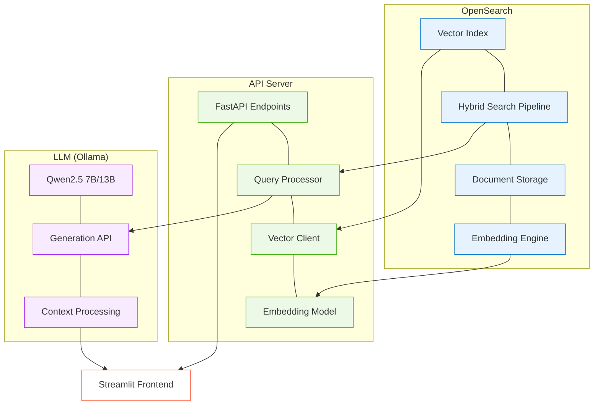

# คู่มือการติดตั้งและการใช้งานระบบ RAG ด้วย OpenSearch และ LLM

## แผนภาพสถาปัตยกรรมระบบ



แผนภาพนี้แสดงสถาปัตยกรรมโดยรวมของระบบ RAG ที่ประกอบด้วย 3 ส่วนหลัก: OpenSearch สำหรับการจัดเก็บและค้นหาข้อมูล, API Server สำหรับเป็นตัวกลางในการเชื่อมต่อ และ LLM สำหรับการสร้างคำตอบจากบริบทที่ได้จากการค้นหา ทั้งหมดนี้เชื่อมต่อกับ Streamlit Frontend ซึ่งเป็นส่วนติดต่อกับผู้ใช้

คู่มือนี้จะแนะนำวิธีการติดตั้งและการใช้งานระบบ Retrieval-Augmented Generation (RAG) โดยใช้ OpenSearch สำหรับการค้นหาและ LLM สำหรับการสร้างคำตอบ โดยเหมาะสำหรับเครื่อง e2-standard-4 (4 vCPUs, 16 GB Memory) ที่รัน Ubuntu 25.04

## สารบัญ

- [คู่มือการติดตั้งและการใช้งานระบบ RAG ด้วย OpenSearch และ LLM](#คู่มือการติดตั้งและการใช้งานระบบ-rag-ด้วย-opensearch-และ-llm)
  - [แผนภาพสถาปัตยกรรมระบบ](#แผนภาพสถาปัตยกรรมระบบ)
  - [สารบัญ](#สารบัญ)
  - [ข้อกำหนดขั้นต่ำของระบบ](#ข้อกำหนดขั้นต่ำของระบบ)
  - [การติดตั้ง OpenSearch](#การติดตั้ง-opensearch)
  - [การติดตั้ง Miniconda และสภาพแวดล้อม](#การติดตั้ง-miniconda-และสภาพแวดล้อม)
  - [การตั้งค่า Hybrid Search Pipeline](#การตั้งค่า-hybrid-search-pipeline)
  - [การสร้างและปรับแต่ง Embedding](#การสร้างและปรับแต่ง-embedding)
  - [การรัน API Server](#การรัน-api-server)
  - [การรัน Frontend](#การรัน-frontend)
  - [การแก้ไขปัญหา](#การแก้ไขปัญหา)
    - [ปัญหา: ไม่สามารถเชื่อมต่อกับ OpenSearch](#ปัญหา-ไม่สามารถเชื่อมต่อกับ-opensearch)
    - [ปัญหา: API ไม่ทำงาน](#ปัญหา-api-ไม่ทำงาน)
    - [ปัญหา: LLM ไม่ทำงาน (สำหรับเครื่อง e2-standard-4)](#ปัญหา-llm-ไม่ทำงาน-สำหรับเครื่อง-e2-standard-4)

## ข้อกำหนดขั้นต่ำของระบบ

- ระบบปฏิบัติการ: Ubuntu 25.04
- หน่วยความจำ: 16 GB (e2-standard-4)
- vCPU: 4 cores
- พื้นที่เก็บข้อมูล: 20GB ขึ้นไป
- Docker และ Docker Compose

**หมายเหตุ**: ด้วย 16 GB ของหน่วยความจำ คุณสามารถรันโมเดล LLM ขนาดเล็กถึงกลางได้ เช่น 7B หรือ บางโมเดล 13B แต่อาจไม่สามารถรันโมเดลขนาดใหญ่ 32B-70B ได้

## การติดตั้ง OpenSearch

1. สร้างเครือข่ายสำหรับ OpenSearch:
   ```bash
   docker network create opensearch-net
   ```

2. รัน OpenSearch ด้วย Docker (ตั้งค่าหน่วยความจำให้เหมาะสมกับเครื่อง e2-standard-4):
   ```bash
   docker run -e OPENSEARCH_JAVA_OPTS="-Xms2g -Xmx2g" \
     -e discovery.type="single-node" \
     -e DISABLE_SECURITY_PLUGIN="true" \
     -e bootstrap.memory_lock="true" \
     -e cluster.name="opensearch-cluster" \
     -e node.name="os01" \
     -e DISABLE_INSTALL_DEMO_CONFIG="true" \
     --ulimit nofile="65536:65536" \
     --ulimit memlock="-1:-1" \
     --net opensearch-net \
     --restart=always \
     -v opensearch-data:/usr/share/opensearch/data \
     -p 9200:9200 \
     --name=opensearch-single-node \
     opensearchproject/opensearch:latest
   ```
    2.1 คำสั่งแบบบันทัดเดียว
    ```bash
    docker run -e OPENSEARCH_JAVA_OPTS="-Xms2g -Xmx2g" -e discovery.type="single-node" -e DISABLE_SECURITY_PLUGIN="true" -e bootstrap.memory_lock="true" -e cluster.name="opensearch-cluster" -e node.name="os01" -e DISABLE_INSTALL_DEMO_CONFIG="true" --ulimit nofile="65536:65536" --ulimit memlock="-1:-1" --net opensearch-net --restart=always -v opensearch-data:/usr/share/opensearch/data -p 9200:9200 --name=opensearch-single-node opensearchproject/opensearch:latest
    ```

3. ตรวจสอบว่า OpenSearch ทำงานถูกต้อง:
   ```bash
   curl -X GET "http://localhost:9200/_cluster/health"
   ```

3.1 ผลลัพธ์
```json
{
  "cluster_name": "opensearch-cluster",
  "status": "yellow",
  "timed_out": false,
  "number_of_nodes": 1,
  "number_of_data_nodes": 1,
  "discovered_master": true,
  "discovered_cluster_manager": true,
  "active_primary_shards": 13,
  "active_shards": 13,
  "relocating_shards": 0,
  "initializing_shards": 0,
  "unassigned_shards": 7,
  "delayed_unassigned_shards": 0,
  "number_of_pending_tasks": 0,
  "number_of_in_flight_fetch": 0,
  "task_max_waiting_in_queue_millis": 0,
  "active_shards_percent_as_number": 65
}
```

    3.1.1 คลัสเตอร์ชื่อ opensearch-cluster กำลังทำงานอยู่
    3.1.2 สถานะ "status":"yellow" หมายความว่าคลัสเตอร์ทำงานได้และสามารถรับคำขอได้ แต่อาจมีบางปัญหาเล็กน้อย
    3.1.3 มี node ทำงานอยู่ 1 node ("number_of_nodes":1)
    3.1.4 มี shard ที่ active อยู่ 13 shard ("active_shards":13)
    3.1.5 มี unassigned shards 7 shard ("unassigned_shards":7) ซึ่งเป็นสาเหตุที่สถานะเป็น yellow

สถานะ "yellow" เป็นเรื่องปกติสำหรับการติดตั้ง OpenSearch แบบ single node เนื่องจาก OpenSearch ต้องการ replica shards แต่เมื่อมีเพียง node เดียว replica shards จะไม่สามารถถูกกำหนดได้ (เพราะ replica ต้องอยู่บน node ที่แตกต่างจาก primary)
ถ้าคุณใช้ OpenSearch สำหรับการพัฒนาหรือทดสอบบนเครื่องเดียว สถานะ yellow นี้ไม่มีปัญหาและคุณสามารถใช้งานได้ตามปกติ
ถ้าต้องการให้สถานะเป็น green คุณสามารถ:

ตั้งค่าจำนวน replica เป็น 0 สำหรับ index ที่คุณสร้าง หรือ
เพิ่ม node เข้าไปในคลัสเตอร์ (ในกรณีที่เป็นระบบ production)


## การติดตั้ง Miniconda และสภาพแวดล้อม

1. ดาวน์โหลดและติดตั้ง Miniconda:
   ```bash
   mkdir -p ~/miniconda3
   wget https://repo.anaconda.com/miniconda/Miniconda3-latest-Linux-x86_64.sh -O ~/miniconda3/miniconda.sh
   bash ~/miniconda3/miniconda.sh -b -u -p ~/miniconda3
   ~/miniconda3/bin/conda init bash
   source ~/.bashrc
   ```

2. สร้างสภาพแวดล้อมสำหรับโปรเจค:
   ```bash
   conda create -n advrag python=3.10
   conda activate advrag
   ```

3. ติดตั้งแพ็คเกจที่จำเป็น:
   ```bash
   pip install llama-index-core llama-index-vector-stores-opensearch llama-index-embeddings-huggingface
   pip install torch torchvision torchaudio
   pip install transformers nest-asyncio fastapi uvicorn streamlit requests
   ```

## การตั้งค่า Hybrid Search Pipeline

1. สร้าง Search Pipeline สำหรับ Hybrid Search:
   ```bash
   curl -X PUT "http://localhost:9200/_search/pipeline/hybrid-search-pipeline" \
     -H "Content-Type: application/json" \
     -d '{
     "description": "Post processor for hybrid search",
     "phase_results_processors": [
       {
         "normalization-processor": {
           "normalization": {
             "technique": "min_max"
           },
           "combination": {
             "technique": "arithmetic_mean",
             "parameters": {
               "weights": [
                 0.3,
                 0.7
               ]
             }
           }
         }
       }
     ]
   }'
   ```

    1.1 คำสั่งแบบบรรทัดเดียว:
    ```bash
    curl -X PUT "http://localhost:9200/_search/pipeline/hybrid-search-pipeline" -H "Content-Type: application/json" -d "{\"description\": \"Post processor for hybrid search\", \"phase_results_processors\": [{\"normalization-processor\": {\"normalization\": {\"technique\": \"min_max\"}, \"combination\": {\"technique\": \"arithmetic_mean\", \"parameters\": {\"weights\": [0.3, 0.7]}}}}]}"
    ```

2. ตรวจสอบว่า pipeline ถูกสร้างแล้ว:
   ```bash
   curl -X GET "http://localhost:9200/_search/pipeline/hybrid-search-pipeline"
   ```

## การสร้างและปรับแต่ง Embedding

1. สร้างไฟล์ `embedding.py` สำหรับสร้าง embeddings:
   ```python
   import os
   import torch
   import nest_asyncio
   import time
   import random
   from llama_index.core import SimpleDirectoryReader, VectorStoreIndex, StorageContext
   from llama_index.core.node_parser import MarkdownNodeParser
   from llama_index.vector_stores.opensearch import OpensearchVectorStore, OpensearchVectorClient
   from llama_index.embeddings.huggingface import HuggingFaceEmbedding
   import pickle

   # Apply nest_asyncio
   nest_asyncio.apply()

   # Check device
   device = torch.device("cuda" if torch.cuda.is_available() else "cpu")
   print(f"Using device: {device}")

   # Setup OpenSearch
   endpoint = os.getenv("OPENSEARCH_ENDPOINT", "http://localhost:9200")
   idx = os.getenv("OPENSEARCH_INDEX", "dg_md_index")
   text_field = "content"
   embedding_field = "embedding"

   # Load documents
   reader = SimpleDirectoryReader(
       input_dir="md_corpus", 
       recursive=True,
       required_exts=[".md", ".markdown"]
   )
   documents = reader.load_data()
   print(f"Loaded {len(documents)} markdown documents")

   # Create nodes
   md_parser = MarkdownNodeParser(chunk_size=1024)
   nodes = md_parser.get_nodes_from_documents(documents, show_progress=True)
   print(f"Created {len(nodes)} nodes")

   # Setup embedding model
   embedding_model_name = 'BAAI/bge-m3'
   embed_model = HuggingFaceEmbedding(model_name=embedding_model_name, max_length=1024, device=device)

   # Get embedding dimension
   embeddings = embed_model.get_text_embedding("box")
   dim = len(embeddings)
   print(f"Embedding dimension: {dim}")

   # Setup OpenSearch client with retry
   def connect_with_retry(max_retries=5, initial_backoff=1, max_backoff=60):
       retries = 0
       while retries < max_retries:
           try:
               client = OpensearchVectorClient(
                   endpoint=endpoint,
                   index=idx,
                   dim=dim,
                   embedding_field=embedding_field,
                   text_field=text_field,
                   engine="faiss"
               )
               return client
           except Exception as e:
               retries += 1
               print(f"Error: {str(e)}")
               if retries == max_retries:
                   raise e
               
               backoff = min(initial_backoff * (2 ** (retries - 1)), max_backoff)
               jitter = random.uniform(0, 0.1 * backoff)
               sleep_time = backoff + jitter
               
               print(f"Connection failed. Retrying in {sleep_time:.2f} seconds... (Attempt {retries}/{max_retries})")
               time.sleep(sleep_time)

   # Connect to OpenSearch
   client = connect_with_retry()
   vector_store = OpensearchVectorStore(client)
   storage_context = StorageContext.from_defaults(vector_store=vector_store)

   # Create index
   index = VectorStoreIndex(nodes, storage_context=storage_context, embed_model=embed_model)

   # Save index
   with open('md_index.pkl', 'wb') as f:
       pickle.dump(index, f)
   print("Index created and saved to md_index.pkl")
   ```

2. รันการสร้าง embeddings:
   ```bash
   python embedding.py
   ```

## การรัน API Server

1. สร้างไฟล์ `api.py` สำหรับเป็น API server:
   ```python
   from fastapi import FastAPI, HTTPException
   from pydantic import BaseModel
   from typing import List, Optional
   from llama_index.vector_stores.opensearch import OpensearchVectorClient, OpensearchVectorStore
   from llama_index.embeddings.huggingface import HuggingFaceEmbedding
   from llama_index.core import VectorStoreIndex, StorageContext
   from llama_index.core.vector_stores.types import VectorStoreQueryMode
   import torch
   from os import getenv
   import nest_asyncio
   import asyncio
   from transformers import AutoTokenizer
   import re

   # Apply nest_asyncio
   nest_asyncio.apply()

   app = FastAPI()

   # Define input data model
   class QueryRequest(BaseModel):
       query: str

   # Initialize HuggingFace embedding model
   device = torch.device("cuda" if torch.cuda.is_available() else "cpu")
   embedding_model_name = 'BAAI/bge-m3'
   embed_model = HuggingFaceEmbedding(model_name=embedding_model_name, max_length=1024, device=device)

   # Get embedding dimension
   embeddings = embed_model.get_text_embedding("test")
   dim = len(embeddings)

   # Initialize OpenSearch client and vector store
   endpoint = getenv("OPENSEARCH_ENDPOINT", "http://localhost:9200")
   idx = getenv("OPENSEARCH_INDEX", "dg_md_index")
   client = OpensearchVectorClient(
       endpoint=endpoint,
       index=idx,
       dim=dim,
       embedding_field="embedding",
       text_field="content",
       engine="faiss"
   )
   vector_store = OpensearchVectorStore(client)

   # Initialize storage context and vector store index
   storage_context = StorageContext.from_defaults(vector_store=vector_store)
   index = VectorStoreIndex(
       nodes=[], storage_context=storage_context, embed_model=embed_model
   )
   retriever = index.as_retriever(similarity_top_k=3, vector_store_query_mode=VectorStoreQueryMode.DEFAULT)

   # Initialize tokenizer for counting tokens
   tokenizer = AutoTokenizer.from_pretrained(embedding_model_name)

   def count_tokens(text: str) -> int:
       return len(tokenizer.encode(text))

   def extract_section_from_metadata(metadata: dict) -> str:
       """Extract section name from metadata based on markdown headers"""
       if "header_text" in metadata:
           return metadata["header_text"]
       
       # Try to find parent header if available
       if "headers" in metadata and metadata["headers"]:
           headers = metadata["headers"]
           if isinstance(headers, list) and len(headers) > 0:
               return headers[-1]  # Get the most specific header
       
       # If no header info is available, try to extract from content
       if "section" in metadata:
           return metadata["section"]
       
       # Fallback to document title or filename if available
       if "title" in metadata:
           return metadata["title"]
       
       # Final fallback
       if "file_path" in metadata:
           filename = metadata["file_path"].split("/")[-1]
           return f"File: {filename}"
       
       return "Unknown Section"

   async def retrieve_query(query: str):
       results = retriever.retrieve(query)
       expanded_results = []
       
       for r in results:
           # Get full content of the node
           try:
               expanded_text = r.node.get_content()
           except AttributeError:
               # If get_content() doesn't exist, try text property directly
               expanded_text = getattr(r, "text", str(r))
           
           # Clean up the text by removing excessive newlines or spaces
           expanded_text = re.sub(r'\n{3,}', '\n\n', expanded_text)
           expanded_text = re.sub(r'\s{2,}', ' ', expanded_text)
           
           # Truncate text to fit within token limit if needed
           token_count = count_tokens(expanded_text)
           if token_count > 512:
               # Simple approach: truncate to first 512 tokens
               words = expanded_text.split()
               truncated_text = ""
               current_tokens = 0
               
               for word in words:
                   word_tokens = count_tokens(word + " ")
                   if current_tokens + word_tokens > 500:  # Leave some margin
                       truncated_text += "..."
                       break
                   truncated_text += word + " "
                   current_tokens += word_tokens
                   
               expanded_text = truncated_text
           
           expanded_results.append((r, expanded_text))
       
       return expanded_results

   @app.post("/search")
   async def search(request: QueryRequest):
       try:
           results = await asyncio.create_task(retrieve_query(request.query))
           response = []
           total_tokens = 0
           
           for r, expanded_text in results:
               tokens = count_tokens(expanded_text)
               total_tokens += tokens
               
               # Extract section information from metadata
               section = extract_section_from_metadata(r.metadata)
               
               response.append({
                   "metadata": r.metadata,
                   "text": expanded_text,
                   "file_path": r.metadata.get("file_path", "N/A"),
                   "tokens": tokens,
                   "page_label": section  # Use section instead of page_label for markdown
               })
               
           return {"results": response, "total_tokens": total_tokens}
       except Exception as e:
           raise HTTPException(status_code=500, detail=str(e))

   if __name__ == "__main__":
       import uvicorn
       uvicorn.run(app, host="0.0.0.0", port=9000)
   ```

2. รัน API server:
   ```bash
   python api.py
   ```

3. ทดสอบว่า API ทำงานถูกต้อง:
   ```bash
   curl -X POST "http://localhost:9000/search" -H "Content-Type: application/json" -d '{"query":"โรคติดเชื้อ"}'
   ```

## การรัน Frontend

1. สร้างไฟล์ `app.py` สำหรับเป็น frontend:
   ```python
   import streamlit as st
   import requests
   import re
   import os
   import base64
   import markdown
   from bs4 import BeautifulSoup

   # Set page config
   st.set_page_config(
       page_title="ระบบค้นหาและตอบคำถามเกี่ยวกับปัญหาสุขภาพ",
       page_icon="🔍",
       layout="wide"
   )

   # สำหรับเครื่อง e2-standard-4 ที่มี memory 16GB คุณสามารถใช้โมเดล 7B หรือ 13B ได้

   # Define your system prompt
   system_prompt = """คุณเป็นผู้เชี่ยวชาญเกี่ยวกับปัญหาสุขภาพ
   ในการตอบคำถาม:
   1. ใช้เฉพาะข้อมูลที่ให้มาในผลการค้นหา
   2. หากไม่มีข้อมูลเพียงพอ ให้ตอบว่า "ขออภัย ไม่มีข้อมูลเพียงพอที่จะตอบคำถามนี้"
   3. ตอบเฉพาะส่วนที่มีข้อมูลสนับสนุนชัดเจน
   4. ใช้รูปแบบการตอบแบบแจกแจงเป็นข้อๆ เพื่อให้อ่านง่าย
   5. สรุปวัตถุประสงค์หรือความสำคัญของหัวข้อที่ถามไว้ท้ายคำตอบ"""

   # Initialize session state
   if "chat_history" not in st.session_state:
       st.session_state.chat_history = []

   if "llm_prompt" not in st.session_state:
       st.session_state.llm_prompt = ""

   # Helper functions
   def add_to_chat_history(entry_type, content):
       st.session_state.chat_history.append((entry_type, content))

   def process_question(question):
       add_to_chat_history("User", question)

       # Call API for search
       try:
           response = requests.post("http://localhost:9000/search", json={"query": question})
           if response.status_code == 200:
               data = response.json()
               search_results = data["results"]
               total_tokens = data["total_tokens"]
               
               # Format results
               response_text = "\n\n".join([
                   f"Text: {result['text']}\nFile Path: {result['file_path']}\nTokens: {result['tokens']}\nSection: {result['page_label']}" 
                   for result in search_results
               ])

               # Create LLM prompt
               llm_prompt = f"""<s>[INST] <<SYS>>
               {system_prompt}
               <</SYS>>

               คำถาม: {question}

               ผลการค้นหาเพิ่มเติม:
               {response_text}

               โปรดตอบคำถามโดยใช้เฉพาะข้อมูลจากผลการค้นหา และทำตามคำแนะนำในการตอบคำถาม
               [/INST]"""

               st.session_state.llm_prompt = llm_prompt

               # Call LLM
               try:
                   llm_payload = {
                       "model": "qwen2.5:7b",  # หรือโมเดลอื่นที่เหมาะกับระบบที่มี 16GB memory
                       "stream": False,
                       "prompt": llm_prompt,
                   }
                   llm_response = requests.post("http://localhost:11434/api/generate", json=llm_payload)
                   
                   if llm_response.status_code == 200:
                       llm_output = llm_response.json()["response"]
                       add_to_chat_history("Search Results", response_text)
                       add_to_chat_history("AI", llm_output)
                       add_to_chat_history("Total Tokens", str(total_tokens))
                   else:
                       add_to_chat_history("Error", f"LLM Error: {llm_response.status_code}")
                       add_to_chat_history("Search Results", response_text)
               except Exception as e:
                   add_to_chat_history("Error", f"LLM Error: {str(e)}")
                   add_to_chat_history("Search Results", response_text)
           else:
               add_to_chat_history("Error", f"Search Error: {response.status_code}")
       except Exception as e:
           add_to_chat_history("Error", f"Search Error: {str(e)}")

   # Main UI
   st.title("ระบบค้นหาและตอบคำถามเกี่ยวกับปัญหาสุขภาพ")
   st.write("ยินดีต้อนรับสู่ระบบอัจฉริยะสำหรับค้นหาข้อมูลและตอบคำถามเกี่ยวกับปัญหาสุขภาพ")

   # Input form
   with st.form(key='question_form'):
       user_input = st.text_input("โปรดระบุคำถามของคุณ:", key="input")
       submit_button = st.form_submit_button(label='ส่งคำถาม')

   if submit_button and user_input:
       process_question(user_input)

   # Display chat history
   if st.session_state.chat_history:
       for i in range(0, len(st.session_state.chat_history), 4):
           interaction = st.session_state.chat_history[i:i+4]
           
           # Display question
           user_question = next((content for entry_type, content in interaction if entry_type == "User"), None)
           if user_question:
               st.markdown("### คำถาม")
               st.markdown(f"""<div style="background-color: #ffeeba; padding: 10px; border-radius: 5px; 
                          font-size: 18px; color: #856404; border: 1px solid #ffeeba; margin-bottom: 10px;">
                          {user_question}</div>""", unsafe_allow_html=True)
           
           # Display search results
           search_results = next((content for entry_type, content in interaction if entry_type == "Search Results"), None)
           if search_results:
               with st.expander("ดูผลการค้นหา", expanded=False):
                   st.text(search_results)
           
           # Display AI response
           ai_response = next((content for entry_type, content in interaction if entry_type == "AI"), None)
           if ai_response:
               st.markdown("### คำตอบ")
               st.markdown(f"""<div style="background-color: #f8d7da; padding: 10px; border-radius: 5px; 
                          font-size: 18px; color: #721c24;">{ai_response}</div>""", unsafe_allow_html=True)
           
           st.markdown("---")

   # Show prompt
   if st.session_state.llm_prompt:
       with st.expander("ดู Prompt ที่ใช้", expanded=False):
           st.code(st.session_state.llm_prompt, language="text")

   # Clear chat history
   if st.button("ล้างประวัติการสนทนา"):
       st.session_state.chat_history = []
       st.session_state.llm_prompt = ""
       st.rerun()
   ```

2. รัน Streamlit app:
   ```bash
   streamlit run app.py --server.address 0.0.0.0
   ```

3. เข้าถึง Streamlit app ได้ที่ http://[เครื่อง-IP]:8501

## การแก้ไขปัญหา

### ปัญหา: ไม่สามารถเชื่อมต่อกับ OpenSearch

1. ตรวจสอบว่า OpenSearch กำลังทำงาน:
   ```bash
   docker ps | grep opensearch
   ```

2. ตรวจสอบ log ของ OpenSearch:
   ```bash
   docker logs opensearch-single-node
   ```

### ปัญหา: API ไม่ทำงาน

1. ตรวจสอบว่า API กำลังทำงาน:
   ```bash
   curl -X POST "http://localhost:9000/search" -H "Content-Type: application/json" -d '{"query":"สวัสดี"}'
   ```

2. ตรวจสอบว่าไฟล์ md_index.pkl มีอยู่จริง:
   ```bash
   ls -la md_index.pkl
   ```

### ปัญหา: LLM ไม่ทำงาน (สำหรับเครื่อง e2-standard-4)

1. ตรวจสอบหน่วยความจำที่มี:
   ```bash
   free -h
   ```

2. ตรวจสอบการทำงานของ Ollama:
   ```bash
   curl -X POST "http://localhost:11434/api/generate" \
     -H "Content-Type: application/json" \
     -d '{"model":"qwen2.5:7b","prompt":"สวัสดี","stream":false}'
   ```
   
3. ดาวน์โหลดโมเดลขนาดเล็กกว่า (เหมาะสำหรับเครื่องที่มี 16GB):
   ```bash
   ollama pull qwen2.5:7b  # ขนาดประมาณ 7-8GB memory
   # หรือ
   ollama pull phi3:mini  # ขนาดประมาณ 4-5GB memory
   ```

4. **สำคัญ**: สำหรับเครื่องที่มี 16GB memory คุณควรใช้โมเดลขนาดไม่เกิน 13B และอาจต้องลดการใช้หน่วยความจำของ OpenSearch ลงหากพบปัญหาการใช้หน่วยความจำมากเกินไป
